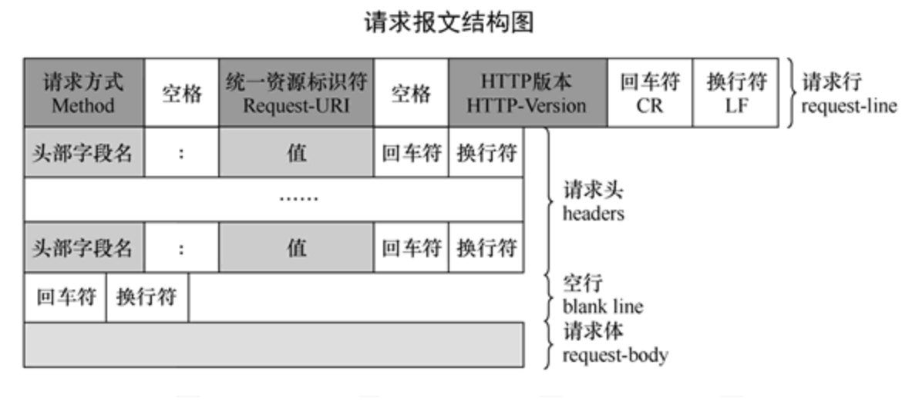
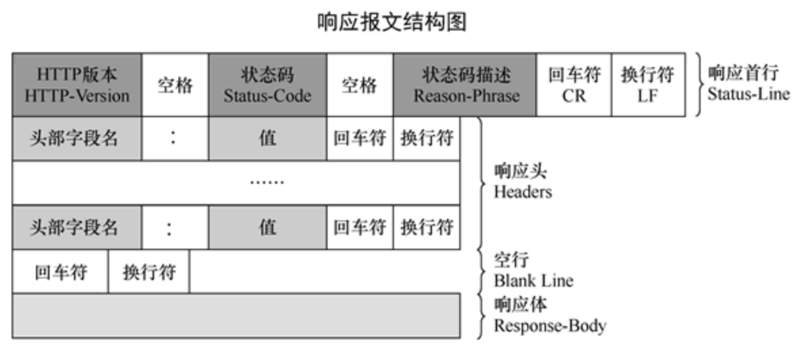
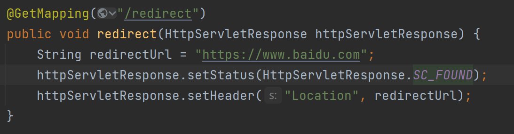

# HTTP
HTTP是应用层的，基于TCP的超文本传输协议
- 无状态：协议自身不对请求和响应之间的通信状态进行保存，任何两次请求之间没有依赖关系
- 无连接：每次连接只处理一个请求
使用80作为默认端口

## 报文结构
### 请求报文

请求报文总体四个部分
1. 请求行
包括请求方法、URL、协议版本，彼此使用空格分隔
2. 请求头
KV形式的辅助信息
3. 空行
分隔报头(请求行+请求头)和请求体，由回车符和换行符组成
4. 请求体
请求发送时携带的数据
		
- 请求行
| 方法       | 说明                     | 支持的HTTP协议版本 |
|------------|--------------------------|--------------------|
| GET        | 获取资源                 | 1.0，1.1           |
| POST       | 传输实体主体(提交信息)   | 1.0，1.1           |
| PUT        | 传输文件                 | 1.0，1.1           |
| HEAD       | 获得报文首部             | 1.0，1.1           |
| DELETE     | 删除文件                 | 1.0，1.1           |
| OPTIONS    | 询问支持的方法           | 1.1                |
| TRACE      | 追踪路径                 | 1.1                |
| CONNECT    | 要求用隧道协议连接代理   | 1.1                |
| LINK       | 建立和资源之间的联系     | 1.0                |
| UNLINE     | 断开连接关系             | 1.0                |

- 请求头
| 请求头           | 含义                                                                 | 示例                                                                 |
|------------------|----------------------------------------------------------------------|----------------------------------------------------------------------|
| Cache-Control    | 用于控制缓存策略，设置缓存的行为，如是否允许缓存、缓存时间、缓存验证方式等 | `Cache-Control: max-age=3600`                                       |
| Connection       | 指示客户端和服务器之间的连接选项，常见值有 `keep-alive` 和 `close`，分别表示保持连接和关闭连接 | `Connection: keep-alive`                                            |
| Date             | 表示请求发送的日期和时间，采用 HTTP 日期格式，服务器可据此进行时间相关处理 | `Date: Wed, 18 Apr 2025 12:00:00 GMT`                               |
| Accept           | 告知服务器客户端能够接受的响应内容类型，服务器会根据此选择合适的内容格式返回 | `Accept: text/html,application/xhtml+xml,application/xml;q=0.9,*/*;q=0.8` |
| Accept-Encoding  | 指定客户端能够接受的编码方式，如 `gzip`、`deflate` 等，服务器会对响应数据进行相应的编码压缩 | `Accept-Encoding: gzip, deflate`                                    |
| Accept-Language  | 表示客户端偏好的语言，服务器可根据此返回对应语言的内容                     | `Accept-Language: en-US,en;q=0.9,zh-CN;q=0.8,zh;q=0.7`              |
| Host             | 指定请求的目标主机和端口号，用于区分同一服务器上的不同虚拟主机或服务       | `Host: www.example.com:8080`                                        |
| Referer          | 标识请求发起的来源页面的 URL，服务器可以借此了解请求的上下文和来源路径       | `Referer: https://www.example.com/page1.html`                       |
| User-Agent       | 包含客户端的相关信息，如浏览器类型、版本、操作系统等，服务器可根据此进行不同的适配和处理 | `User-Agent: Mozilla/5.0 (Windows NT 10.0; Win64; x64) AppleWebKit/537.36 (KHTML, like Gecko) Chrome/112.0.5615.137 Safari/537.36` |
| Content-Type     | 用于 POST、PUT 等请求，指示请求体中数据的类型，如 `application/json`、`application/x-www-form-urlencoded`、`multipart/form-data` 等 | `Content-Type: application/json`                                    |
| Content-Length   | 表示请求体的长度，以字节为单位，服务器可据此判断是否完整接收了请求数据       | `Content-Length: 1024`                                              |

### 响应报文

响应报文总体四个部分：
1. 状态行：包含协议版本、状态码，状态码描述
2. 响应头：响应体的KV形式附属信息
3. 空行：回车符和换行符组成，分隔报头和响应体
4. 响应体：响应的数据

- 常用状态码含义

1xx多用于实验场景
| 状态码            | 含义                                                                 |
|-------------------|----------------------------------------------------------------------|
| 200 OK            | 请求成功，服务器已成功处理请求并返回了请求的资源。                   |
| 201 Created       | 请求成功，并且服务器创建了一个新的资源。通常在使用 POST 方法创建新资源时返回。 |
| 204 No Content    | 请求成功，但服务器没有返回任何内容。常用于只需要执行某个操作而不需要返回数据的情况。 |
| 301 Moved Permanently | 请求的资源已被永久移动到新的 URL。客户端应使用新的 URL 进行后续请求。 |
| 302 Found         | 请求的资源临时移动到了新的 URL。客户端应使用新的 URL 进行本次请求，但后续请求仍可使用原 URL。 |
| 304 Not Modified  | 客户端发送了附带条件的请求（如 If - Modified - Since 等头信息），服务器认为资源未被修改，客户端可以使用缓存的资源。 |
| 400 Bad Request   | 客户端发送的请求有语法错误或不符合请求规范，服务器无法理解请求。     |
| 401 Unauthorized  | 客户端请求需要身份验证，但客户端未提供有效的身份凭证或凭证无效。     |
| 403 Forbidden     | 服务器理解请求，但拒绝执行该请求，通常是因为客户端没有足够的权限访问资源。 |
| 404 Not Found     | 服务器无法找到请求的资源。可能是 URL 输入错误或资源已被删除。       |
| 405 Method Not Allowed | 客户端请求使用的方法（如 GET、POST 等）不被服务器允许用于请求的资源。 |
| 415 Unsupported Media Type | 客户端发送的请求体中的数据格式不被服务器支持，如服务器不支持请求的 Content - Type。 |
| 500 Internal Server Error | 服务器内部发生错误，无法完成请求。通常是服务器端的代码出现异常或配置问题。 |
| 502 Bad Gateway   | 服务器作为网关或代理，从上游服务器收到了无效的响应。               |
| 503 Service Unavailable | 服务器暂时无法处理请求，通常是因为服务器过载或正在进行维护。       |
| 504 Gateway Time - out | 服务器作为网关或代理，在等待上游服务器响应时超时。               |

## 多版本差异

- HTTP/0.9

1991年发布。极其简单，只能传输纯文本，仅支持GET请求，没有HTTP头信息和状态码.服务器只能回复HTML格式字符串，不能回应别的格式

已被弃用
- HTTP/1.0

1996年发布。
1. 在0.9基础上扩展了请求方法，包括GET，POST，HEAD
2. 新增了1xx-5xx五类状态码 
3. 定义了消息头部
4. 可以支持长连接keep-alive，但需要显式设置
5. 不支持连接复用，每次请求都要建立TCP连接
6. 请求为blocking，下一个请求发送必须在收到前一个请求包的响应包后
导致：请求延迟大，网络带宽不能充分利用

> 队头阻塞：在计算机网络范畴中是性能首先的现象
>
> 是一列数据的第一个数据包(队头)被阻塞，导致整列数据包受阻的现象
>
> TCP会引起队头阻塞，HTTP/1.0也会引起队头阻塞

- HTTP/1.1（目前使用最广泛的版本）

1997年发布
1. 引入缓存机制
2. 扩展错误状态码
3. 新增Host字段
>
> 可以将请求发往一台服务器的不同网站
>
> 在一台WEB服务器上同一个IP地址和端口号上使用不同的主机名的虚拟WEB站点
>
> 也就是使用nginx在收到相同的ip和端口号后针对用户请求的Host再次进行转发
>
4. 默认开启keepalive
一个连接被多个请求复用，减少连接建立和断开的开销
5. 请求范围引入range域
6. 引入管道机制
管道机制允许客户端同时发起多个请求，无需等待响应到来
> 一定程度上缓解了队头阻塞问题，但没有完全解决
>
> 因为服务端是按照接收到请求包的顺序响应的，也就是说如果先后收到请求AB，服务端必须先响应A再响应B

- HTTP/2
1. 必须搭配TLS1.2一起使用，即必须HTTPS
2. 头部和数据用二进制表示，而不再是ASCII的文本
3. 一条连接内支持多条流并行，即多路复用
一条流阻塞不会阻塞其他流，解决了HTTP协议中的队头阻塞问题，但传输层TCP的队头阻塞仍然存在
4. 首部压缩
5. 允许服务器未经请求，主动向客户端发送资源

> 除了TLS强制使用之外，各个改动极大降低了网络延迟，提升网页加载速度

- HTTP/3

1. 不再采用TCP作为传输层协议，而是使用UDP。UDP不提供可靠保证和流控服务，引入了应用层的QUIC，工作在UDP和HTTP之间。QUIC保证数据有序，拥塞控制等，而且继承了TLS

2. 在HTTP/2的多路复用解决HTTP队头阻塞基础上，绕开TCP后，完整解决队头阻塞问题；不再需要TCP三次握手，进一步降低请求延迟

3. 解决连接迁移问题：TCP协议在移动切换到wifi时因为IP改变，需要重建连接。HTTP3采用CID标识一条流，改变IP不会造成影响

## 常用机制

### 跨域(CORS)处理
跨域问题源于浏览器的同源策略
> 同源策略规定，只有当两个URL的协议、域名和端口都相同时，浏览器才允许他们之间进行资源共享

当前端服务器所在的域和后端服务器所在的域不相同时，即请求前端用A域名端口，请求后端用B域名端口，则产生跨域问题

浏览器将在收到服务器响应时阻止跨域
> 浏览器接收跨域响应，检查响应头信息，如果相关字段表明当前请求不允许被跨域访问，浏览器将阻止该请求的响应被前端页面获取和处理
> 所以想要避免跨域问题，可以在后端服务器响应报文中添加相应的字段信息，以避免浏览器阻止跨域
> 关键字段和含义:
>- Access-Control-Allow-Origin: 指定允许访问该资源的外域URI，可以是具体的域名，也可以用*标识允许所有域名访问（携带凭证如Cookie的请求不能用通配符）
>- Access-Control-Allow-Method：指定服务器允许的跨域请求方法，如GET,POST,PUT,DELETE等
>- Access-Control-Allow-Credentials：指定是否允许客户端在跨域请求中携带凭证，值为true或false
>- Access-Control-Allow-Headers：列出服务器允许的请求头字段
>- Access-Control-Expose-Headers：允许客户端访问的响应头。
>- Access-Control-Max-Age：预检请求的缓存时间（单位：秒）

### 身份认证与授权
#### Cookie
Cookie由服务器端生成

在浏览器请求服务器时，服务端在HTTP响应中携带Set-Cookie: xxx=yyy，以键值对形式表示，如果有多个Cookie键值对，就有多个Set-Cookie

再次发起请求时，浏览器会自动在Request Header中增加Cookie字段，以Cookie: xxx=yyy; aaa=bbb形式，携带Cookie信息

通过Cookie，服务器可以为请求设置一些标识，比如通过Cookie知道某些请求来自某些用户等

浏览器会将Cookie键值对信息缓存在本地，这些键值对信息会以域名为界存储，Cookie也只会被设置到相同域名的请求中，防止不同域名之间的 Cookie 相互干扰和泄露用户信息

浏览器会根据 Cookie 的过期时间来管理 Cookie。当 Cookie 过期后，浏览器会自动删除该 Cookie

Cookie 还可以设置路径属性，只有当请求的路径与 Cookie 的路径匹配或为其子路径时，浏览器才会发送该 Cookie

由于 Cookie 存储在用户本地，并且可能包含敏感信息，如用户登录凭证等，因此在使用 Cookie 时需要注意安全性，防止 Cookie 被窃取或篡改

可以设置Set-Cookie: key=value; HttpOnly 或Set-Cookie: key=value; Secure来增强安全性
> HttpOnly使得该Cookie键值对只能被Http协议(包含Https)访问，不能被Js脚本访问，主要用于防止跨站脚本攻击(XSS)
>
>  Secure使得浏览器仅在HTTPS请求下才发送该Cookie，主要用于防止中间人攻击

> XSS跨站脚本攻击：攻击者通过注入恶意脚本到他的网页中，当用户访问该网页时，恶意脚本会在用户的浏览器中执行。如果网页中的某些敏感信息（如用户的会话 ID、身份验证 Token 等）存储在 Cookie 中，且这些 Cookie 没有设置HttpOnly属性，那么恶意脚本就可以通过 JavaScript 代码（如document.cookie）获取这些 Cookie 信息，进而利用这些信息来模拟用户身份进行恶意操作。而设置了HttpOnly属性后，恶意脚本无法访问这些 Cookie
>
> 中间人攻击：HTTP 协议中，数据是以明文形式传输的，这意味着在数据传输过程中，攻击者可以截获和篡改数据。如果用户的敏感信息存储在 Cookie 中，且这些 Cookie 没有设置Secure属性，那么中间人就有可能截获这些 Cookie 信息，进而利用这些信息来模拟用户身份进行恶意操作。而设置了Secure属性后，只有在使用 HTTPS 协议进行通信时，浏览器才会发送这些 Cookie，而HTTPS数据在传输过程中是加密的，中间人无法截获和篡改数据

#### Token
token指令牌或凭证，在Web开发中一般指用户登录凭证

前端指引用户表单输入信息进行登陆后，登录接口返回token，前端可以将token缓存在本地，每次将token设置在请求中约定的header处便于后端识别请求的用户和用户的登陆状态

后端产生token，一般是随机字符串，并在后端数据库中与用户信息进行绑定，在请求到来时从约定header中取出token，并用token寻找用户信息，从而知道用户是否登录、接口权限、数据归属等信息

### 重定向
重定向机制主要指服务器返回给客户端的响应中，状态码为302，且Header中由Location字段指定需要客户端重定向到的网址，主要用于服务器在客户端提交表单后并处理成功后，指引客户端跳转到下一个页面，比如登陆后跳转到主页等

如下代码以SpringMVC为基础开发指引客户端重定向

### 流式传输
#### SSE
SSE(Server-Sent Events) 服务器发送事件

客户端发起一个请求，服务器保持连接打开，并不断向客户端发送事件流
后端服务器需要设置响应头Content-Type为text/event-stream，并保持连接打开，不断向客户端发送事件数据

SSE 的数据格式是简单的文本，每行以特定的字段开头，如data:表示事件数据，event:表示事件类型等。每个事件以两个换行符\n\n结尾

#### 分块传输编码（Chunked Transfer Encoding）
分块传输编码允许服务器在发送响应时，将数据分成多个块进行传输，而不必事先知道响应的总长度

前端通常不需要特殊处理，浏览器会自动处理分块传输编码的响应，将接收到的块组合成完整的数据

后端服务器需要设置响应头Transfer - Encoding为chunked，并按块发送数据。每个块由块的长度（以十六进制表示）和换行符开头，接着是块的数据，最后以换行符结尾

每个块由块的长度（十六进制表示）、换行符、块数据、换行符组成，最后以长度为 0 的块（0\r\n\r\n）结束

### 缓存
####  强缓存
> 只要本地的资源在缓存有效期内，直接取本地缓存，避免与服务器交互
>
> Cache-Control: HTTP/1.1用于控制缓存的通用首部字段，有多种指令
>> max-age: 指定资源缓存时间，单位为秒
>> no-cahce: 需要先与服务器验证资源的有效性，再决定是否使用缓存
>> no-store: 禁止使用任何缓存
>
> Expires：是 HTTP/1.0 中用于控制缓存的首部字段
>
> 它指定了一个具体的日期和时间，在这个时间之前，浏览器可以使用本地缓存的资源。不过，由于Expires使用的是服务器的时间，可能会因为客户端和服务器时间不一致而导致缓存失效，因此在 HTTP/1.1 中推荐使用Cache-Control

#### 协商缓存
当强缓存失效时，浏览器会向服务器发送一个请求，询问服务器该资源是否有更新

服务器根据请求中的信息进行判断，如果资源没有更新，则返回 304 状态码，告诉浏览器可以使用本地缓存；如果资源有更新，则返回新的资源和 200 状态码

> ETag：是服务器为资源生成的一个唯一标识符
> 
> 当资源发生变化时，ETag的值也会相应改变。浏览器在后续请求时，会通过If-None-Match首部字段将之前缓存的ETag值发送给服务器，服务器将其与当前资源的ETag进行比较，如果相同则表示资源未更新。
>
> Last - Modified：表示资源的最后修改时间
>
> 浏览器在后续请求时，会通过If-Modified-Since首部字段将之前缓存的最后修改时间发送给服务器，服务器将其与当前资源的最后修改时间进行比较，如果相同则表示资源未更新

#### 缓存策略的应用场景
1. 频繁更新的资源：对于经常更新的资源，如新闻资讯、实时数据等，建议设置较短的缓存时间或使用no-cache指令，以确保用户能够及时获取到最新的内容。
2. 不经常更新的资源：对于不经常更新的资源，如图片、CSS、JavaScript 文件等，可以设置较长的缓存时间，以减少对服务器的请求，提高网站的性能。
3. 敏感信息资源：对于包含敏感信息的资源，如用户的个人信息、订单信息等，应使用no-store指令，禁止浏览器进行缓存，以确保信息的安全性

#### 一次请求来说明缓存流程
1. 客户端发起请求，可能是请求网页、图片、服务器数据等
2. 检查强缓存
> 缓存key内容可能包含请求方法、URL、请求头等
> 
> 浏览器查看本地是否有本次请求的缓存资源，同时根据缓存中保存的Cache-Control首部字段的max-age指令或Expires首部字段指定的时间来判断缓存是否过期
>
> 如果缓存资源未过期，直接使用缓存资源，不向服务器请求，即命中强缓存
>
> 如果缓存资源不存在或者已经过期，则检查协商缓存

3. 检查协商缓存
> 强缓存未命中，客户端会在请求中携带If-None-Match(对应ETag)和If-Modified-Since(对应Last-Modified)首部字段发送请求给服务器。服务器接收到请求后根据这两个字段来判断资源是否有更新
>
> 如果资源未更新，即ETag和Last-Modified值与客户端发送的一致，服务器返回304 Not Modified状态码。客户端收到后直接使用本地缓存的资源
>
> 资源已更新，服务器返回200 OK状态码和新的资源内容

4. 客户端更新缓存
> 客户端收到服务器返回的新资源(状态码200 OK),或者收到304NotFound但缓存已经过期需要更新有效期，会对本地缓存进行替换或者根据服务器的缓存控制信息更新缓存属性
>
> 如果服务器返回Cache-Control首部包含no-cache或no-store，客户端则不使用缓存或删除缓存

### 内容协商
请求方发送头
- Accept
用于告知服务器客户端能够接受的响应内容类型，即媒体类型（MIME 类型）。如Accept: text/html
- Accept-Encoding
作用：指定客户端能够接受的内容编码方式，服务器可以根据这个字段对响应数据进行相应的编码压缩，以减少数据传输量。
示例：Accept-Encoding: gzip, deflate 表示客户端支持 gzip 和 deflate 两种编码方式
- Accept-Language
作用：表示客户端偏好的语言，服务器可以根据这个字段返回对应语言的内容。
示例：Accept - Language: en-US;zh-CN; 表示客户端优先接受中文（中国大陆），其次是美式英语
- Accept-Charset
作用：指定客户端能够接受的字符编码，服务器会根据这个字段选择合适的字符编码来发送响应数据。
示例：Accept-Charset: UTF-8 表示客户端优先接受 UTF-8 编码

响应方返回头
- Content-Type
作用：指示响应内容的媒体类型和字符编码。服务器通过这个字段告知客户端响应数据的格式和编码方式。
示例：Content-Type: text/html; charset=UTF-8 表示响应内容是 HTML 格式，使用 UTF-8 字符编码
- Content-Encoding
作用：说明响应内容所使用的编码方式，与客户端的 Accept-Encoding 字段相对应。客户端需要根据这个字段对响应数据进行解码。
示例：Content-Encoding: gzip 表示响应数据使用了 gzip 编码。
- Content-Language
作用：指定响应内容所使用的语言，与客户端的 Accept-Language 字段相对应。
示例：Content-Language: en - US 表示响应内容使用的是美式英语

常见的数据类型（媒体类型）
- 文本类型
    - text/html：超文本标记语言，用于创建网页。
    - text/plain：纯文本，没有任何格式。
    - text/css：层叠样式表，用于定义网页的样式。
    - text/javascript：JavaScript 代码，用于实现网页的交互效果。
- 图像类型
    - image/jpeg：JPEG 图像格式，常用于照片等。
    - image/png：PNG 图像格式，支持透明通道，常用于图标、图形等。
    - image/gif：GIF 图像格式，支持动画效果。
- 应用类型
    - application/json：JSON（JavaScript Object Notation）数据格式，常用于前后端数据交互。
    - application/xml：XML（eXtensible Markup Language）数据格式，用于数据的存储和传输。
    - application/pdf：PDF（Portable Document Format）文档格式，用于跨平台的文档展示。
    - application/octet - stream：二进制流，通常用于下载文件，服务器不指定具体的文件类型，由客户端自行判断。

