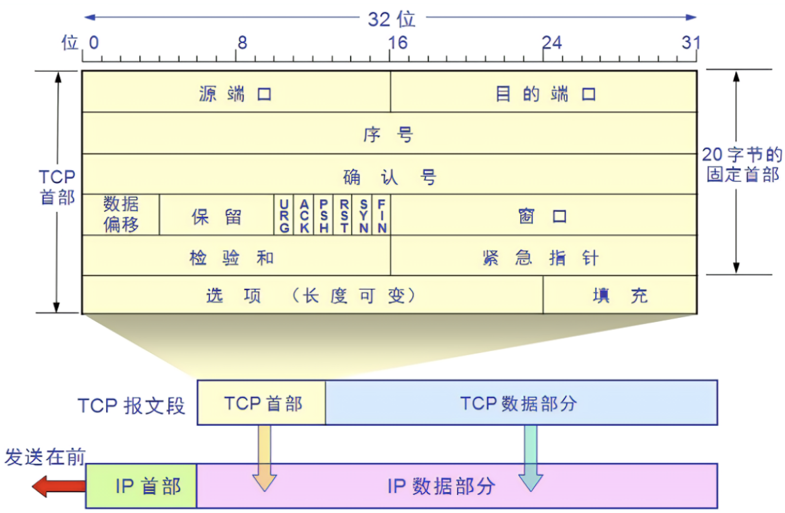
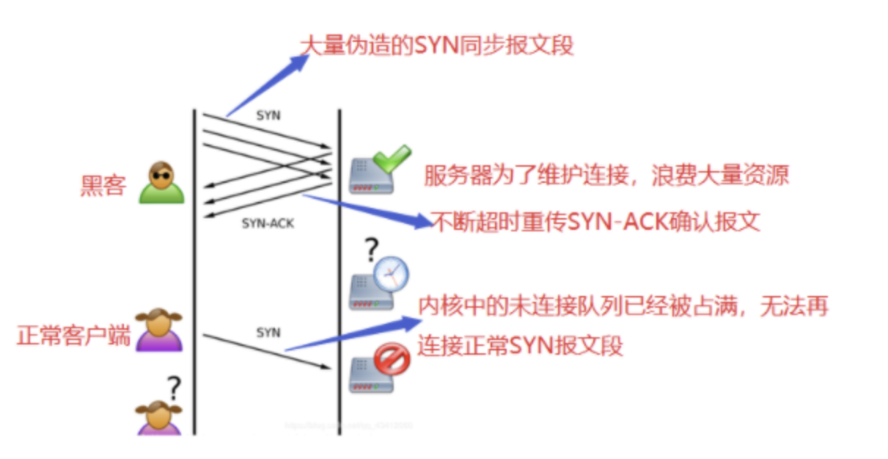
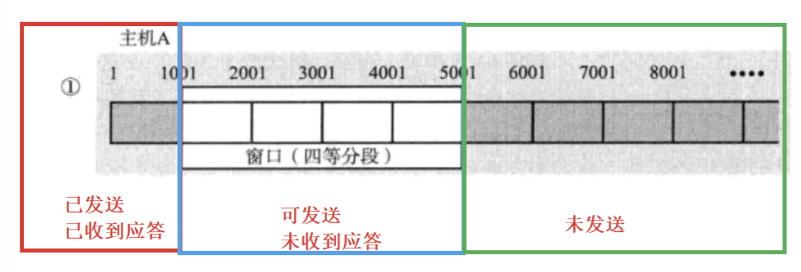

# TCP

TCP是一种面向连接的、可靠的、基于字节流的传输层通信协议

## 报文结构

-  源端口：发送方使用的端口号，16位
- 目的端口：接收方使用的端口号，16位
- 序号：本报文段发送数据的第一个字节的编号，32位
- 确认号：接收方期望接收到的下一个报文段的第一个字节的编号
- 数据偏移(首部长度)：指数据段中的数据部分的起始处距离TCP报文段起始处的偏移量，也就是TCP报文的报头部分的长度，接收端根据这个知道数据（有效载荷）从何处开始 4位
- 保留字段：TCP协议将来的发展预留的空间，目前必须全部为0，6位
- 标志位字段：共六个标志位，每个1bit
- 窗口大小：表示发送该TCP报文的接收窗口还可以接受多少字节的数据量，用于TCP的流量控制，16位
- 校验和：用于确认传输的数据有无损坏。发送端基于数据内容校验生成一个数值，接收端同样生成一个数值进行对比，相同的数据有效，反之无效则丢弃数据包，16位
- 紧急指针：仅当标志位的URG字段值位1才有意义。指出有效载荷中位紧急数据的字节数。当所有紧急数据处理完，TCP告知应用程序恢复到正常操作。即使接收方窗口大小为0，也可以发送紧急数据，因为紧急数据无需缓存，16位
- 选项字段：长度不定，但是必须是32bit的整数倍，即4字节的整数倍。内容可变，所以使用首部长度来区分选项部分的具体长度

## 如何分离首部和载荷（确认首部长度）
TCP固定首部长度20字节，以及选项字段
首部长度字段为4bits，最大可表示长度为1111，即15。表示单位是4字节
所以TCP首部最长是15*4 = 60字节
固定首部为20字节，选项部分为4字节的倍数，最大为40字节
这说明了数据偏移字段标识首部长度的原理
根据首部长度，可以分离首部和载荷

## 连接的建立和断开
TCP连接是TCP协议在网络中建立的可靠通信链路
> 这种可靠指的是不丢包，就是网络不太好的情况下可以尽量保证数据的完整接收（发送确认和重发）
>
> 由IP协议锚定双方地址，由底层协议传输数据包，由高层协议进行数据的加解密
>
> 换言之，TCP的可靠通信链路中保证的是传输和接收数据包的完整性，而不是包揽了链路的实际构建、数据包防伪等过程。不要把可靠性的理解在TCP扩展太多

### 为什么要建立连接
1. 可靠性验证：建立连接的过程实际就是通信双方验证各自的发送和接受能力是否正常，双方的信道是否通畅
2. 协商参数：如序号初始值，MSS，是否启用SACK等

### 连接的建立 - 三次握手
1. 服务器初始化状态
服务器端进程函数顺序：socket => bind => listen => accept
 - socket()创建套接字listenfd
- bind()将套接字和端口绑定
- listen()让listenfd成为监听套接字，后续连接通过监听套接字获取，服务器处于监听状态
- accept()进程阻塞，直到有客户连接请求到达才返回

2. 客户端发起连接请求 - 第一次握手
客户端进程函数顺序:socket => connect
- socket()创建套接字
- connect()调用时操作系统自动bind()，然后客户端进程就会向服务端进行发送连接请求报文

> 连接请求报文首部的标志位SYN=1
> 
> 同时选定一个初始序号SEQ=x，x是随机产生的整数
>
> TCP规定SYN=1的报文段不可以携带数据，但消耗一个序号
>
> 此时客户端进程进入SYN-SENT(同步报文已发送状态)

3. 服务器同意建立连接，回复确认 - 第二次握手
服务器端进程收到连接请求报文，同意建立连接
从listenfd监听套接字获取客户端信息
服务器端操作系统向客户端发送SYN报文段进行确认
> 连接确认报文首部标志位SYN=1，ACK=1，确认号ack=x+1
>
> 同时为自己选择一个初始序号seq=y
同样不能携带数据，消耗一个序号
>
>TCP服务器进入SYN-RCVD(同步报文已收到)状态

4. 客户端确认连接已经被确认，发送确认连接信息 - 第三次握手
客户端进程收到服务器的确认报文，向服务器发送确认报文表示自己收到
> 确认报文首部ACK=1，确认号ack=y+1，序号seq=x+1
> 可以携带数据，不携带数据则不消耗序号
>
> 客户端认为连接建立成功，进入ESTABLISHED(已建立连接)状态，准备发送数据
>
> 服务器收到确认报文，进入ESTABLISHED(已建立连接)状态，准备接受数据

### 形象理解和问题
#### 三次握手的形象理解
1. 客户端用seq=x标识自己，发送SYN=1的连接请求报文，告诉服务器我想建立连接
2. 服务器用seq=y标识自己，发送ACK=1 SYN=1 确认号ack=x+1的确认报文，告诉客户端我是y，同意了序号x的连接请求
3. 客户端发送确认连接报文ACK=1，确认号ack=y+1，告诉服务器这是序号x的连接确认报文(+1)，而且我收到了seq=y的连接同意信息，我认为我们之间的连接已经建立
4. 服务器收到确认报文，认为连接已经建立

#### 初始序列号SEQ为什么要随机?
seq序号表示的是发送的TCP报文数据部分的起始字节位置，服务器/客户端可以通过序号正确读取数据。如果不是随机分配起始序列号，那么黑客就会很容易获取客户端与服务器之间TCP通信的初始序列号，然后通过伪造序列号让通信主机读取到携带病毒的TCP报文，发起网络攻击

#### 服务器没有收到客户端的确认报文怎么办?
操作系统会给每个处于SYN-RCVD状态的服务器进程设定一个计时器，如果超过一定时间还没有收到客户端第三次握手的ACK确认报文，将会重新发送第二次握手的确认报文，直到重发达到一定次数才会放弃

#### 为什么不能两次握手?
两次握手意味着，服务器来确认连接的建立
1. 如果确认报文丢失，客户端不知道服务器确认连接已经建立，就不会发送数据，服务器会维护不成功的TCP连接
2. 容易遭受SYN洪水攻击，攻击者发送大量的SYN请求连接报文，服务器对每个报文都建立连接，消耗大量资源
3. 可能有已失效的连接报文传输到服务器，服务器维护失效连接
> 失效连接的产生原因和两次握手的后果
客户端A发送给服务器B连接报文，但报文在某个网路节点滞留，迟迟不到达服务器
客户端A等待服务器B确认报文太久，以至于客户端认为刚才的连接报文失效，不再等待确认报文
服务器B突然收到连接报文，并确认连接发回确认报文
客户端没有在等待确认报文，就不会处理确认报文，也不会向服务器发送数据，于是服务器维护的是一个无效连接

只要握手次数是偶数次，就会把连接的确认带来的成本转移给服务器

#### 为什么必须是三次握手?
1. 奇数次握手，客户端先建立连接
2. 防止已失效的连接报文突然传到服务器，导致错误
> 三次握手时已失效的连接报文突然传到服务器，服务器发回确认报文
客户端无回复，服务器也不会认为连接确认，不会做接受数据准备等，连接仍然未被建立
3. 三次是验证双方信道通畅，发送接收能力正常的最小成本

#### 怎么处理SYN洪水攻击?
SYN Flood是互联网上最原始、最经典的DDoS（Distributed Denial of Service）攻击之一
攻击方式：
- 攻击者短时间伪造大量不存在的IP地址，并用这些IP地址向服务器发送大量SYN连接请求报文
- 服务器需要为每个SYN报文回复ACK，但是一直收不到客户端的ACK报文，就要重发一定次数才放弃，这回非常消耗资源
- 导致没有资源处理正常的连接，服务器处理连接能力停摆

解决方法：
- 缩短SYN Timeout：SYN洪水攻击的效果取决于服务器保持的半连接数量=SYN攻击频率 * SYN Timeout，缩短接收到SYN报文到确认报文废弃并丢弃连接的时间，可以大量减少服务器载荷
- 设置SYN Cookie：为每个连接请求的IP地址分配Cookie，如果短时间收到某个IP地址的大量连接请求，就不再处理这个IP地址的连接报文
- 设置防火墙，白名单或者黑名单

### 连接的断开 - 四次挥手
1. 客户端发送FIN结束报文 - 第一次挥手
客户端主动断开连接，客户端进程调用close(fd)关闭套接字，操作系统发送FIN结束报文，并停止发送数据，主动关闭TCP连接
> FIN结束报文，FIN=1，seq=u，u是前面已发送的最后一个字节的序号+1
>
> 客户端进入FIN_WAIT_1(终止等待)状态，等待服务器发送确认报文
>
> FIN报文不携带数据，消耗一个序号

2. 服务器收到，回复确认报文 - 第二次挥手
服务器收到客户端的FIN结束报文，并立即发送确认报文
> 确认报文ack=u+1，seq=v，v等于服务器之前已发送的数据的最后一个字节的序号+1
>
> 服务器进入CLOSE_WAIT(关闭等待)状态
>
> 服务器通知上层应用程序，客户端不再向服务器发送数据，但服务器如果有数据发送，客户端仍要接受，服务器会继续发送未发完的数据给客户端
>
> TCP连接处于半关闭状态(half-close)
>
> 客户端收到服务器确认报文后，客户端进入FIN_WAIT2(终止等待2)状态，等待服务器数据发送完，发送FIN结束报文

3. 服务器发送FIN结束报文
服务器数据发送完毕后，应用进程调用close(fd)通知TCP释放连接，向客户端发送FIN结束报文
> 结束报文FIN=1，seq=w，w是此前发送数据的最后一个字节序号
>
> 同时需要回复确认号ack=u+1
>
> 服务器进入LASK_ACK(最后确认)状态，等待客户端确认

4. 客户端收到，回复确认报文 - 第四次挥手
客户端收到服务器FIN结束报文，向服务器发送报告ACK确认报文
> 确认报文ACK=1，确认号ack=w+1，序号seq=u+1(第一次挥手的FIN报文消耗一个序号)
>
> 客户端进入TIME_WAIT(时间等待状态)

TCP连接此时仍未被释放，必须经过时间等待器TIME_WAIT timer设置的时间2MSL后，客户端才进入CLOSED状态

MSL(Maximum Segment Lifetime，最长报文寿命)，是一个TCP报文存活的最长时间，RFC793建议为2分钟，可以根据实际情况设置更小的值

即客户端进入TIME_WAIT状态后，要经过4分钟才进入CLOESD状态，才可以建立下一个连接
当客户端撤销相应的传输控制快TCB(socket调用前建立)，才算结束TCP连接

> 先发起释放连接请求的，后结束TCP连接

### 形象理解与问题
#### 四次挥手的形象理解
1. 客户端数据发送完毕，决定断开连接，发送结束报文告诉服务器，我最后发送的数据是u，我要断开了
2. 服务器收到，回复收到了关于最后发送数据是u的断开请求，告知我目前最后发送数据是v，我还可能会继续发送数据
3. 客户端收到服务器的确认，知道服务器知道自己要断开，同时知道服务器还会继续发送数据，自己仍须接收，直到收到服务器的结束FIN报文
4. 服务器数据发送完毕，发送FIN结束报文，标示自己这边已经发送完毕数据，可以断开。我的这次断开针对最后收到数据是u的那个连接，我最后发送的数据序号是w
5. 客户端收到服务器说他结束了，回复收到服务器的结束，知道对方发送的最后数据是w。客户端开始等待一段时间2MSL，没什么问题就释放TCP连接

#### 为什么连接是三次握手，关闭是四次挥手？
建立连接也可以是四次握手，中间服务器发回的SYN和ACK可能被分成两个报文发送
关闭连接时中间服务器给客户端发送的确认报文和FIN结束报文可能合并，如果服务器已经没有数据要发送的话。但是如果还有数据要发送就得分开，发送完数据才发送FIN
> TCP通信是全双工的，发送FIN表示一端不再继续发送，但是还会继续接收。

> 收到FIN报文，只是关闭一个方向的连接，TCP处于半关闭状态

#### 为什么客户端要等待2MSL才进入CLOSED状态？
1. 保证客户端最后发送的ACK能到达服务器
保证可靠的终止TCP连接。因为如果报文丢失，服务器接收不到ACK报文，处于LAST_ACK状态的服务器会超时重传FIN报文，而客户端能在2MSL时间内收到重传的FIN报文。收到后客户端会重传确认，并重新计时。最后双方可以正常进入CLOSED状态
2. 防止已经失效的连接请求报文出现在本次TCP连接
客户端发送完最后的ACK报文后经过2MSL，可以让本次TCP连接持续时间内产生的所有报文都从网络上消散。下一个新的TCP连接就不会出现旧的请求报文

#### TIME_WAIT状态何时出现？带来哪些问题？
TIME_WAIT是发起连接的一方收到对方的FIN结束报文，发出ACK确认报文后进入的状态
TIME_WAIT是为了让TCP报文得以自然消散，被动关闭的一方能够正常关闭连接
- 服务器TIME_WAIT：如果短时间内大量关闭客户端连接，会出现大量TIME_WAIT状态，TCP连接没有释放，就会占据大量的tuple数据(包含目的和源IP、协议号、目的和源端口号)，严重消耗服务器资源
- 客户端TIME_WAIT：短时间大量TIME_WAIT无法释放端口，大量消耗客户端的端口号，只有65535个，消耗完毕就无法开启新的TCP连接

## 可靠性策略
### 校验和（单包数据无损）
TCP报文首部存在校验和字段，用于验证数据是否完整传输
发送端基于数据内容校验生成一个数值，接收端同样生成一个数值进行对比，相同的数据有效，反之无效则丢弃数据包

### 序列号(数据包有序、去重)
TCP在操作系统中有自己的缓冲区，应用层调用的write、sendto等接口，是将自己定义的额缓冲区数据，拷贝到TCP的发送缓冲区
TCP面向字节流，TCP缓冲区中以字节为单位，将缓冲区划分为类似字符数组的形式，数组自带的下标作为TCP缓冲区字节的编号
TCP传输的每个字节都会按顺序编号
数据可以在接收到后有序拼接
由于网络延迟导致的重发数据重复接收等，可以用序列号去重

### 确认应答
TCP协议规定，接收方接收数据，必须发送确认报文
序列号和确认号是TCP缓冲区的下标
> 序列号：是本报文第一个字节的编号。TCP连接中传输的字节流的每个字节都会按顺序编号。序列号x：我给你的第一个字节是编号x的
>
> 确认号：发送方给接收方发送数据，接收方收到数据就要给发送方发送确认报文。确认报文中的确认号表示接收方期望收到发送方下一个报文的第一个字节的编号。确认号y：我期望你下次给我发的第一个字节是编号y的

接收方收到数据后，根据序列号给出确认号，让发送方知道接收方接受到哪些数据
应答报文ACK=1，此时确认号字段才有效

确认应答可以提升通信效率
发送方完全可以一次性发送多个报文，每个报文是不同段的数据
- 如果中间确认应答丢失，但是只要收到靠后确认号的应答，就可以确认前面的数据接收方已经收到
- 如果靠前序列号的报文丢失，接收方即使收到了后面序列号的数据，也只会给发送方返回丢失之前的序号的确认应答。前面的丢失报文由这个确认应答触发重传，而后面的发送报文没有返回确认报文，触发超时重传。

### 超时重传
数据在网络传输过程中可能丢包
发送方的发送报文和接收方的确认报文都可能丢失
都会导致发送方收不到接收方的确认报文
TCP规定，在报文发送后的一个时间间隔后，如果还没收到确认报文，发送方一律认为报文丢失，要重发报文

超时时间的考虑
- 最理想状态，保证确认应答一定能在这个时间内返回
- 设置太长影响重传效率，设置太短会频繁发送重复报文
- 不同网络环境要设置不同的超时时间

TCP动态计算超时时间
- 各种操作系统中，超时以500ms为一个单位控制，每次设置超时时间都是500ms的整数倍
- 重发一次后仍得不到应答，等待2*500ms再重传
- 仍得不到应答，等待4*500ms再重传，指数递增
- 累积到一定重传次数，TCP认定对方主机异常，强制关闭连接

### 连接管理（通信能力检测）
就是三次握手四次挥手
数据传输前，验证双方的发送和接收能力，以及通信环境的正常

### 流量控制（滑动窗口）
接收端处理数据速度有限，发送端发送太快打满接收缓冲区，会导致丢包，引起丢包重传等一系列反应
TCP根据接收端接受能力决定发送端发送速度（滑动窗口机制）

### 拥塞控制
如果网络状态比较拥堵，不清楚网络状态，盲目根据接收方窗口大小发送数据，将导致网络更加拥堵，数据发送不出去
TCP引入慢启动机制，先发送少量数据，探测信道状态，了解拥堵情况，再决定按照多大的速度传输数据
设置拥塞窗口cwnd，大小为swnd
慢启动：
1. 一开始将cwnd设置为一个较小的值，通常是一个MSS
2. 每经过一个传输轮次（即cwnd所允许发送的报文都连续发出去，且收到了对已发送的最后一个字节的确认），cwnd的大小就会加倍

通过指数级增长的方式，快速探测网络的可用带宽，但为了防止增长过快导致网络拥塞，还要引入慢开始门限ssthresh

拥塞避免：
1. 当swnd超过ssthresh时，就会从慢开始算法切换到拥塞避免算法
2. 在拥塞避免阶段，拥塞窗口不再加倍增长，而是每次收到一个确认报文，拥塞窗口就增加 1 个 MSS。也就是说，拥塞窗口以线性的方式缓慢增长

避免拥塞窗口增长过快，导致网络拥塞，让网络能够在一个相对稳定的状态下运行

快恢复：
在每次超时重传(快重传)后，慢启动阈值会变成检测到网络拥塞时的窗口大小的一半，同时将拥塞窗口cwnd设置为1

> MSS：TCP协议报文能传输的最大数据段长度
>
> 理论值：TCP报文最长65535字节，去掉20字节IP首部，最小20字节TCP首部，理论MSS=65495 字节
>
> 实际值：主要由链路层的最大传输单元（MTU）决定。MTU 是指数据链路层能够承载的最大数据长度。例如，以太网的 MTU 通常是 1500 字节，在这种情况下，减去 20 字节的 IP 首部和 20 字节的 TCP 首部，MSS 的值为 1500 - 20 - 20 = 1460 字节
>
> 协商机制：MSS 的值是在 TCP 连接建立时通过三次握手进行协商确定的。在客户端和服务器进行 TCP 连接建立的过程中，双方会在 SYN 报文中交换各自能够支持的 MSS 值，最终会选择一个双方都能接受的最小值作为本次连接的 MSS

## 性能提升策略
### 滑动窗口
发送方一次发送多个报文，报文的数量由滑动窗口大小确定
TCP报文首部中，有一个16位大小的窗口值，该字段反映的是发送该报文的主机的接收缓冲区的剩余大小，也就是发送方反应自己的接受能力
三次握手时，就会通报对方自己的窗口大小，双方基于每次通信的报文中的窗口大小，来动态调整自己要发送给对方的报文数量，就是滑动窗口

发送方根据对端发送的窗口大小，将自己的发送缓冲区分成三个部分
滑动窗口是可以发送未收到应答的部分
- 窗口大小是指无需等待确认应答而可以继续发送数据的最大值
- 发送滑动窗口内的数据，不需要等待任何ACK，直接发送
- 收到一个ACK后，滑动窗口向后移动，继续发送后续的数据
- 操作系统内核维护滑动窗口，开辟发送缓冲区记录哪些数据没有应答，确认应答的数据从缓冲区删除（被后续数据覆盖）
- 窗口越大，网络吞吐率越高

相关问题
1. 滑动窗口只能向右，不能向左
因为左边数据已经发送且收到接收应答，不应该再发送
2. 滑动窗口大小可以变化，可以为0
滑动窗口大小取决于对方的通告，可以辩变化。0表示对方暂时不能接收数据，可能是接收缓冲区满，于是发送方不再发送数据，但是会定期发送窗口探测报文，知晓接收方的窗口大小
3. 滑动窗口能一直向右滑动不越界
因为发送缓冲区是环形队列，左边的部分会被新的数据覆盖
4. 丢包如何重传
如果数据送到，ACK丢失，可以用后续的ACK进行确认
如果是数据没送到，则有快重传机制

### 快重传
数据包丢失情况下，发送方会一直收到前序报文序号+1的应答
如果连续三次收到前序报文序号+1的应答，发送端会立即重发丢失的数据包
即快重传机制

### 延迟应答
接收方收到数据放入接收缓冲区，应用层会将缓冲区数据取走处理，释放接收缓冲区
如果接收方收到数据就立即返回ACK，返回的窗口会比较小，但是实际上一会会空出更大的窗口，接收方实际可以在一会后处理更多的数据
所以如果接收端等一会再应答，通报的窗口可以更大
窗口越大，网络吞吐量越大，传输效率越高
延迟应答：
- 每隔N个包就应答一次
- 超过最大延迟时间就应答一次
不同操作系统不同，一半N=2，延迟时间取200ms

### 捎带应答
和确认应答搭配使用，在一方返回确认应答ACK报文时，可以在报文中携带数据，携带数据的确认应答就是捎带应答，提升数据传输效率

## 拆包和粘包问题
包指的是应用层的数据包
拆包，即应用层的数据在TCP被拆成多个数据包分别传输和被接收
拆包传输，需要保证接收方能够根据拆包还原原本数据包
由TCP数据包的序列号连接和可靠性传输不丢包来保证

粘包，两个应用层包的结尾和开头在一个TCP包内，即前后的多个应用层数据包粘连
粘包传输，需要接收方能够分离应用层的数据包，即明确边界
TCP的协议头没有数据长度字段，只有序列号便于分解TCP首部和载荷
- 在传输层角度，TCP接收TCP报文，按序号将报文按顺序放在接收缓冲区，等待上层应用读取时，将载荷分离向上交付
- 在应用层角度，接收到TCP传输的载荷，载荷时一串连续字节数据。应用程序无法得知完整数据包的边界，多个包混杂粘连在一起，无法合理解析
- 所以应用层协议应该明确数据包的边界。比如HTTP header中有length，明确一个HTTP body部分的长度，取这个长度的数据作为一个response进行解析

明确包的边界是避免粘包问题的根本
- 对于定长的包，每次按固定大小读取
- 对于变长的包，约定包总长度的字段，从而知道包的结束位置
- 对于变长的包，也可以约定包之间的分隔符

## 总览
TCP是字节流的传输层协议

TCP的任务是保证数据的完整传输

TCP通过三次握手检测双方发送和接收能力，以及信道传输能力

通过校验和保证数据传输的无损

通过序列号来保证数据包的顺序，让接收方能还原数据包

通过确认应答、超时重传机制来保证不丢包

通过滑动窗口机制(流量控制)来根据对方的接受能力调整发送速度

通过拥塞控制来探测网络情况调整发送速度

在确认应答机制中通过延迟应答，增大滑动窗口大小，提升数据吞吐

在超时重传机制中通过快重传提升丢包重传速度

在确认应答机制中通过捎带应答，多传输一些数据
