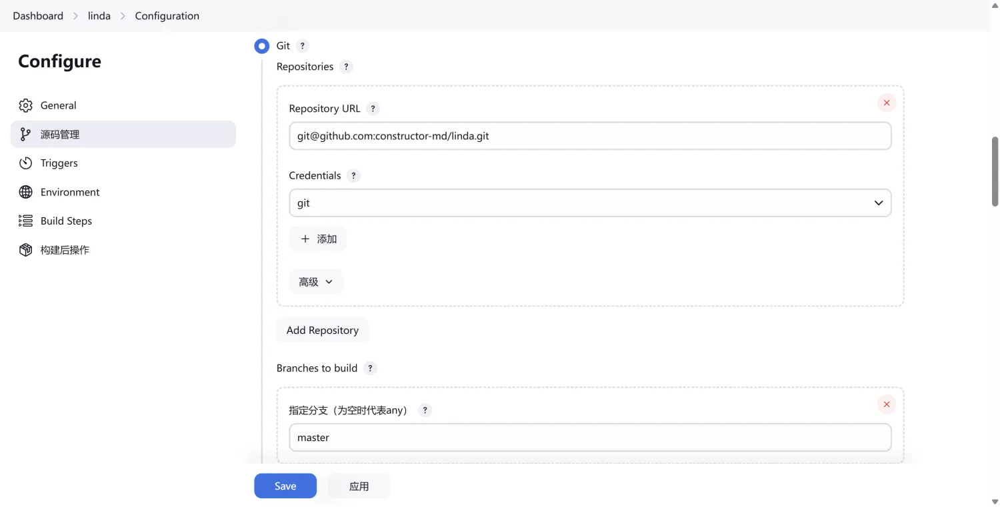

# Jenkins安装与Web项目部署
考虑到可移植性、对宿主机的影响最小，方便试错等问题  
采用Docker-Compose运行Jenkins  
自定义jenkins镜像，镜像内安装jdk、maven、node以便安装运行  
如果需要支持多版本的软件环境，则定制多版本的镜像即可  

## 部署Jenkins单节点
### 目录及权限
```
sudo mkdir /DATA/jenkins /DATA/jenkins/data

sudo chmod -R 777 /DATA/jenkins/data
```

### 定制Dockerfile
提前安装Maven及Node 便于Java和前端打包  
运行镜像后尽量减少一些配置  
```
# 使用最新的 Jenkins LTS 镜像
FROM jenkins/jenkins:lts

# 切换到 root 用户进行系统级操作
USER root

# 更新系统软件包列表
RUN apt-get update && apt-get install -y \
    wget \
    gnupg2 \
    software-properties-common

# 下载并安装 JDK 8
RUN wget -O /tmp/openjdk-8.tar.gz https://download.java.net/openjdk/jdk8u41/ri/openjdk-8u41-b04-linux-x64-14_jan_2020.tar.gz
RUN mkdir -p /usr/lib/jvm
RUN tar -xzf /tmp/openjdk-8.tar.gz -C /usr/lib/jvm
RUN rm /tmp/openjdk-8.tar.gz

# 添加 NodeSource 源以安装 Node.js 18
RUN curl -sL https://deb.nodesource.com/setup_18.x | bash -

# 更新软件包列表
RUN apt-get update

# 安装 Node.js 18
RUN apt-get install -y nodejs

# 下载并安装 Maven 3.6.3
RUN wget https://archive.apache.org/dist/maven/maven-3/3.6.3/binaries/apache-maven-3.6.3-bin.tar.gz -P /tmp
RUN tar -xzf /tmp/apache-maven-3.6.3-bin.tar.gz -C /opt
RUN ln -s /opt/apache-maven-3.6.3 /opt/maven
RUN rm /tmp/apache-maven-3.6.3-bin.tar.gz

# 配置 Maven 国内源
RUN mkdir -p /usr/share/maven/ref/
COPY settings.xml /usr/share/maven/ref/settings.xml

# 配置 Node.js 国内源
RUN npm config set registry https://registry.npmmirror.com

# 配置Maven环境变量
ENV MAVEN_HOME=/opt/maven
ENV PATH=$PATH:$MAVEN_HOME/bin

# 切换回 jenkins 用户
USER jenkins
```
放在 /DATA/jenkins目录下

### 预备 Maven 的 setting.xml
```
<settings xmlns="http://maven.apache.org/SETTINGS/1.0.0"
          xmlns:xsi="http://www.w3.org/2001/XMLSchema-instance"
          xsi:schemaLocation="http://maven.apache.org/SETTINGS/1.0.0 http://maven.apache.org/xsd/settings-1.0.0.xsd">
    <mirrors>
	 <mirror>
      		<id>alimaven</id>
      		<mirrorOf>central</mirrorOf>
      		<name>aliyun maven</name>
      		<url>http://maven.aliyun.com/nexus/content/repositories/central</url>
    	</mirror>
    </mirrors>
</settings>
```
放在 /DATA/jenkins目录下

### 构建镜像
```
cd /DATA/jenkins
sudo docker build -t custom-jenkins:latest .
```
预备命令
```
# 删除镜像
# 先停止容器
sudo docker-compose stop jenkins
# 删除停止状态的容器
sudo docker rm custom-jenkins
# 删除镜像
sudo docker image rm custom-jenkins 
```

### docker-compose.yml
```
version: "3"
services:
  jenkins:
    image: custom-jenkins:latest
    container_name: jenkins
    restart: always
    environment:
      TZ: Asia/Shanghai
    volumes:
      - /DATA/jenkins/data:/var/jenkins_home
    ports:
      - "18080:8080"
      - "50000:50000"
```

### 启动Jenkins容器
```
sudo docker-compose up -d jenkins
```

### 初始化设置
#### 尝试访问Jenkins控制台
ip:18080


#### 获取Jenkins初始密码登录
```
# 进入docker容器
sudo docker exec -it jenkins /bin/bash

# 查看初始密码
cat /var/jenkins_home/secrets/initialAdminPassword

# 或者通过查看 docker 启动日志获取
sudo docker logs jenkins

```

#### 登陆后选择安装推荐插件


#### 创建管理员用户


#### 实例配置
保持默认即可


#### 初始化完毕

点击开始使用


## 全局配置（Maven JDK Git SSH Node）
### Maven
#### settings.xml 路径设置
以使换源的配置生效


#### 安装Maven插件
Maven Integration/Maven Integration plugin  
安装maven集成插件，新建任务才可以新建Maven任务


#### 全局配置
告知 jenkins maven 环境变量，用于后续命令执行


### JDK
不配置，maven 使用 jenkins 的 java 环境进行打包

### SSH
#### 插件安装
Publish Over SSH

这里显示的是安装后的状态，直接在avaliable plugins中搜索安装即可

#### 全局配置


### Git
相关插件已经在初始化时安装，现在仅需要配置

#### Jenkins 添加 GitHub 的主机密钥
将 GitHub 的主机密钥添加到 SSH 客户端的 known_hosts 文件中
```
# 进入 docker 执行
sudo docker exec -it jenkins /bin/bash

ssh-keyscan -t ed25519 github.com >> ~/.ssh/known_hosts
```
不执行这一步会报错：
```
stderr: No ED25519 host key is known for github.com and you have requested strict checking.
Host key verification failed.
fatal: Could not read from remote repository.
```

#### Github 添加 Jenkins 密钥
jenkins 数据目录已经挂载出来，可以直接在宿主机上查看密钥
```
cat /DATA/jenkins/data/.ssh/id_rsa.pub
```
将密钥设置到项目所在的github账户中


#### 全局配置


## Java项目打包部署
### 项目运行服务器配置
目标是让jenkins打jar包，发送到指定目录，并执行docker-compose up -d name，即可启动项目  
所以目标运行服务器必须配置好项目运行的信息

#### 登录用户组修改
让Jenkins配置的SSH登录用户能使用docker-compose命令（将当前用户加入docker用户组）  
使用jenkins配置的SSH登录用户登录服务后执行
```
sudo usermod -aG docker $USER
# 重新登陆刷新用户组
su - $USER
```

#### 目录创建
```
sudo mkdir /DATA/java/kuibu-service
```
先将application.yaml配置文件复制到该目录   
后续jar包也会在该目录

#### docker-compose.yml
```
kuibu-service:
    image: openjdk:8-jdk-alpine
    container_name: kuibu-service
    restart: always
    environment:
      TZ: Asia/Shanghai
    volumes:
      - /DATA/java/kuibu:/app
      - /etc/localtime:/etc/localtime
    ports:
      - "8123:8123"
    command: "java -jar /app/app.jar -Xms256M -Xmx256M -Xmn128M -Xloggc:/app/logs/kuibu-service-gc-%t.log -XX:MetaspaceSize=128M -XX:MaxMetaspaceSize=128M -XX:+HeapDumpOnOutOfMemoryError -XX:HeapDumpPath=/app/logs/kuibu-service-oom-dump.hprof -XX:+PrintGCDetails -XX:+PrintGCDateStamps -XX:+PrintHeapAtGC -XX:+PrintGCCause -XX:+UseGCLogFileRotation -XX:NumberOfGCLogFiles=5 --spring.config.location=/app/application.yaml "
```
容器启动命令指定了jar包位置和配置文件位置，使用jar外面的配置文件

#### 测试

可以自行打包上传jar包，改名为app.jar启动docker-compose测试

### 新建Maven项目


#### 代码拉取配置
前面Git配置好了两边的信息，这里才能好拉代码


#### 构建后分发和启动包


#### 成功启动


## Node 前端项目打包
### 项目运行服务器配置
主要是配置nginx转发到dist，jenkins到时打包项目文件发送到服务器指定文件夹即可

### 项目文件和打包上传
#### 创建项目文件夹
我的 nginx 是 docker-compose 部署的，nginx 的 /usr/share/nginx/html 目录挂载到宿主机的 /DATA/web 目录下  
将项目dist放到该目录下处理
```
sudo mkdir /DATA/web/knowledge-chain
```

#### 打包上传
```
# 项目内有 .env.production 文件
# "build:prod": "vite build --mode production",
# 打包指定 --mode 参数，vite会自动加载根目录下对应的.env.[mode]文件
# 文件中以VITE_开头的变量会被注入到import.meta.env对象中，可以用于打包不同环境的后端访问路径等
# 打包命令
npm run build:prod
# 将打包的dist文件夹压缩成zip，上传到服务器指定目录
```

#### nginx配置
```
sudo vim /DATA/nginx/conf/nginx.conf

server {
    listen [::]:8222 ssl;
    http2 on;
    server_name thinking-structure.top;
    ssl_certificate /etc/nginx/certs/thinking-structure.top_bundle.crt;
    ssl_certificate_key /etc/nginx/certs/thinking-structure.top.key;

    location / {
        root   /usr/share/nginx/html/knowledge-chain/dist/;
        index  index.html index.htm;
        try_files $uri $uri/ /index.html; # 处理单页应用的路由问题
    }
}
```

#### 打开防火墙
```
ufw allow 8222/tcp
```

### Jenkins配置
#### 新建自由风格项目

#### 配置代码拉取



#### 配置打包命令


#### 将所有打包结果传输到指定服务器目录即可

