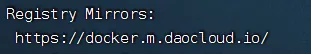

# Ubuntu
采用版本：24.01

安装过程：全部 Done

## 非Root用户上传文件
```
# 赋予指定用户组用户在某个文件夹及其子文件夹上传文件的权限
 sudo chown -R quanta:quanta /DATA
```

## 时区设置
```
# 查看当前时区
timedatectl
# 查看东八区全称
timedatectl list-timezones | grep Shanghai
# 设置时区
sudo timedatectl set-timezone Asia/Shanghai
```

## host设置
便于多主机内网互相访问
```
sudo vim /etc/hosts

# 补充相关机器的ip 主机名
192.168.1.11 dataserver1
192.168.1.12 dataserver2
192.168.1.13 dataserver3
```

## OpenSSH安装
```
sudo apt update && sudo apt upgrade
sudo apt install openssh-server
service ssh status
# 随后可以本机SSH使用安装过程设置的账户密码登录服务器
```

### 修改监听端口
```
sudo vi /etc/ssh/sshd_config
# 内容
Port 2222
```
修改后要重启

### 重启
```
# Ubuntu22版本之前：
sudo systemctl restart sshd
# Ubuntu22版本之后：
sudo systemctl daemon-reload
sudo systemctl restart ssh.socket
```

## Docker安装(指定版本)
### apt依赖安装
```
sudo apt-get install apt-transport-https ca-certificates curl gnupg-agent software-properties-common
```

### 添加阿里云docker GPG密钥
```
curl -fsSL http://mirrors.aliyun.com/docker-ce/linux/ubuntu/gpg | sudo apt-key add -
```

### 添加阿里云镜像源
```
sudo add-apt-repository "deb [arch=amd64] http://mirrors.aliyun.com/docker-ce/linux/ubuntu $(lsb_release -cs) stable"

#更新
sudo apt-get update
```

### 查看有哪些可安装版本
```
sudo apt-cache madison docker-ce

# 列出版本
sudo apt-cache madison docker-ce | awk '{ print $3 }'
```
第二列是版本号，第三列是存储库的名称

版本号提取： 第二列的第一行字符串为 5:19.03.9~3-0~ubuntu-bionic ，那么版本号为 5:19.03.9~3-0~ubuntu-bionic，版本号字符串必须写全第二列的整个字符串

### 安装最新版
```
sudo apt-get install -y docker-ce
```

### 安装指定版本
```
sudo apt-get install -y docker-ce=5:27.3.1-1~ubuntu.24.04~noble
```

### 安装检查(版本查看)
```
sudo docker --version
```

### 修改镜像源
```
sudo vim /etc/docker/daemon.json

{
            "registry-mirrors": [
                            "https://docker.m.daocloud.io"
                                ]
}

```

修改后要重启docker

```
sudo systemctl daemon-reload		#重启daemon进程
sudo systemctl restart docker		#重启docker

```

检查修改成功
```
sudo docker info
```



### 限制容器日志大小
不限制会直接打到磁盘爆满
```
sudo vim /etc/docker/daemon.json

{
  "registry-mirrors": ["https://docker.m.daocloud.io"],
  "log-driver":"json-file",
  "log-opts": {"max-size":"10k", "max-file":"3"}
}

# 重启docker
sudo systemctl daemon-reload
sudo systemctl restart docker
```

### Hello World
```
sudo docker pull hello-world
sudo docker run hello-world
```

### 命令启停
```
sudo systemctl start docker
sudo systemctl stop docker
```

### 自动唤醒
默认会开启自动唤醒，stop docker进程时会显示：
```
Stopping 'docker.service', but its triggering units are still active:
docker.socket
```
docker被访问时会被自动启动

一般不会想关闭，如果要关闭：
```
sudo systemctl stop docker.socket
```

### 开启自启
```
sudo systemctl enable docker
```

## Curl安装
```
sudo apt install curl
```

## DockerCompose安装（指定版本）
与Docker的版本适配关系
https://docs.docker.com/compose/releases/release-notes/

### 指定版本安装
docker装的是27.3.1 对应compose版本是2.30.x

使用2.30.1

```
sudo curl -L "https://github.com/docker/compose/releases/download/v2.30.1/docker-compose-linux-x86_64" -o /usr/local/bin/docker-compose
```
或者自行下载上传后执行：
```
# 下载：到github docker compose上找所需版本包
https://github.com/docker/compose/releases/download/v2.30.1/docker-compose-linux-x86_64
https://github.com/docker/compose/releases

# 上传后转移目录
sudo cp docker-compose-linux-x86_64 /usr/local/bin/docker-compose
```
### 添加Docker Compose执行权限
```
sudo chmod +x /usr/local/bin/docker-compose
```

### 安装检查
```
docker-compose --version
```

## Docker卸载
### 完全卸载Docker及安装时自动安装的所有包
```
sudo apt-get autoremove docker docker-ce docker-engine  docker.io  containerd runc
```

### 删除没有删除的相关插件
```
sudo apt-get autoremove docker-ce-*
```

### 删除docker的相关配置&目录
```
sudo rm -rf /etc/systemd/system/docker.service.d
sudo rm -rf /var/lib/docker
```

### 确认docker卸载完毕（查看版本）
```
sudo docker --version
```
如果还有，可能存在snap版本的，删除
```
sudo snap remove --purge docker
```

### 删除Docker相关文件
```
whereis docker
sudo rm -rf /usr/bin/docker
```

## 防火墙UFW控制
### 查看防火墙状态
```
sudo ufw status
```

### 查看防火墙状态 包括默认规则
```
sudo ufw status verbose
```

### 设置默认拒绝入站流量
```
sudo ufw default deny incoming
```

### 设置默认允许出站流量
```
sudo ufw default allow outgoing
```

### 防火墙启停
```
sudo ufw enable
sudo ufw disable
```

### 允许/禁用端口
```
sudo ufw allow 2222/tcp
sudo ufw deny 22/tcp
```

### 删除规则
```
sudo ufw delete allow 6379/tcp
```

### 防火墙开机自启
```
sudo systemctl status ufw
```


### ifconfig使用安装
```
sudo apt install net-tools
```

### 扩容磁盘（分区扩展+提升逻辑卷大小和根目录空间）
```
# 操作之前先停止各个docker容器等程序
sudo docker-compose stop container_name
# 持续重启的容器可能无法接收停止命令 使用down强制停止
sudo docker-compose down container_name

# 进入 fdisk 程序
sudo fdisk /dev/sda

# 输入 d 表示要删除分区
Command (m for help): d
# 输入 3 表示要删除的是 /dev/sda3
Partition number (1-3, default 3): 3
# 显示已删除
Partition 3 has been deleted.

# 输入 n 表示创建新分区
Command (m for help): n
# 直接回车表示选择分区号为默认3
Partition number (3-128, default 3): 
# 直接回车默认起始扇区
First sector (4198400-1430257630, default 4198400): 
# 直接回车默认结束扇区为使用所有剩余空间
Last sector, +/-sectors or +/-size{K,M,G,T,P} (4198400-1430257630, default 1430255615): 

Created a new partition 3 of type 'Linux filesystem' and of size 680 GiB.
Partition #3 contains a LVM2_member signature.

# yes 表示删除原本的GPT/MBR签名 会导致分区信息丢失
# no 表示保留旧签名 只是对磁盘进行小调整 比如扩展
Do you want to remove the signature? [Y]es/[N]o: n

# w 保存修改
Command (m for help): w

The partition table has been altered.
Syncing disks.


# 重新加载分区表
sudo partprobe
# 扩展 LVM物理卷
sudo pvresize /dev/sda3
# 扩展逻辑卷
sudo lvextend -l +100%FREE /dev/mapper/ubuntu--vg-ubuntu--lv
# 调整文件系统大小
sudo resize2fs /dev/mapper/ubuntu--vg-ubuntu--lv
# 查看当前的文件占用情况
sudo fdisk -l
Disk /dev/sda: 682 GiB, 732291923968 bytes, 1430257664 sectors
Disk model: Virtual disk    
Units: sectors of 1 * 512 = 512 bytes
Sector size (logical/physical): 512 bytes / 512 bytes
I/O size (minimum/optimal): 512 bytes / 512 bytes
Disklabel type: gpt
Disk identifier: 0493D914-0713-4A60-93B8-B83236128F4C

Device       Start        End    Sectors  Size Type
/dev/sda1     2048       4095       2048    1M BIOS boot
/dev/sda2     4096    4198399    4194304    2G Linux filesystem
/dev/sda3  4198400 1430255615 1426057216  680G Linux filesystem


Disk /dev/mapper/ubuntu--vg-ubuntu--lv: 680 GiB, 730140246016 bytes, 1426055168 sectors
Units: sectors of 1 * 512 = 512 bytes
Sector size (logical/physical): 512 bytes / 512 bytes
I/O size (minimum/optimal): 512 bytes / 512 bytes

# 已经给/dev/sda3和/dev/mapper/ubuntu--vg-ubuntu--lv扩展到了680G
df -h
Filesystem                         Size  Used Avail Use% Mounted on
tmpfs                              1.2G  114M  1.1G  10% /run
/dev/mapper/ubuntu--vg-ubuntu--lv  669G   11G  631G   2% /
tmpfs                              5.9G     0  5.9G   0% /dev/shm
tmpfs                              5.0M     0  5.0M   0% /run/lock
/dev/sda2                          2.0G   95M  1.7G   6% /boot
tmpfs                              1.2G   12K  1.2G   1% /run/user/1000

# 根目录可用空间已经扩展到了669G
```

## 切换用户和修改密码
```
# 切换用户
su user

# 修改密码
passwd user

# 修改root用户密码
sudo passwd root
```

## 固定本机内网IP 禁用DHCP
```
# 编辑netplan配置文件
sudo vim /etc/netplan/50-cloud-init.yaml

# 内容如下  注释了原本的配置
# This file is generated from information provided by the datasource.  Changes
# to it will not persist across an instance reboot.  To disable cloud-init's
# network configuration capabilities, write a file
# /etc/cloud/cloud.cfg.d/99-disable-network-config.cfg with the following:
# network: {config: disabled}
#network:
#    ethernets:
#        ens192:
#            dhcp4: true
#    version: 2
network:
  ethernets:
  # ens192名称和原始配置保持一致
    ens192:
      dhcp4: false
      addresses: [192.168.1.11/24] # 需要的本机ip
      routes:
        - to: default
          via: 192.168.1.1 # 网关地址
      nameservers:
        addresses: [192.168.1.1] # DNS地址
  version: 2


# 使得配置生效
sudo netplan apply


```