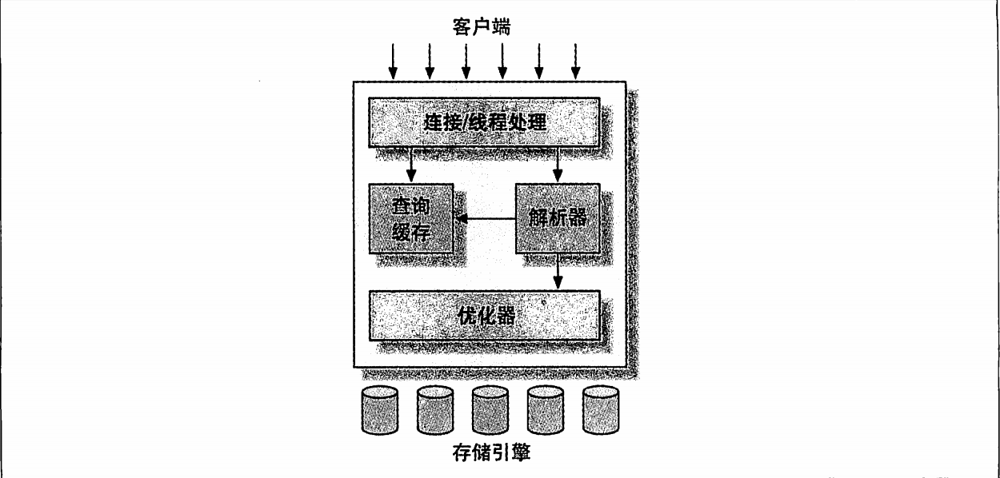

# MySQL
## 逻辑架构

主要可以分为三层：
- 最上层：包括客户端连接/线程处理，不是MySQL独有的部分，大多数基于网络的C/S架构的工具或者服务都有类似的架构。用于：连接处理、授权认证、安全等。
- 第二层：包括大多数MySQL的核心服务功能，包括查询解析、分析、优化、缓存和所有的内置函数（例如：日期、时间、数学和加密函数）。所有跨存储引擎的功能都在这层实现：存储过程、触发器、视图等。
- 第三层：包括存储引擎。存储引擎负责数据的存储和提取，每个存储引擎各有优劣。服务器通过API与存储引擎进行通信，使用接口屏蔽了存储引擎之间的差异。存储引擎API包含几十个底层函数，用于执行“开始一个事务”“根据主键提取一行记录”等操作。存储引擎不会解析SQL，存储引擎间不也互相通信，仅仅是响应上层服务器的请求。

## 连接管理与安全性
每个客户端都会在服务器进程中拥有一个线程，这个连接的查询只在这个单独的线程中执行，线程只能轮流在某个CPU核心或CPU中运行。服务器会缓存线程，避免为每个连接频繁创建和销毁线程。

客户端连接使用用户名、原始主机信息和密码校验，也可使用SSL方式连接。连接成功后会验证是否有执行某个特定查询的权限。

## 优化与执行
MySQL会解析查询，并创建内部数据结构（解析树），对其进行各种优化，包括重写查询、决定表的读取顺序以及选择合适的索引等。

用户可以通过特殊的关键字提示(hint)优化器，影响它的决策过程。
也可以通过请求优化器解释(explain)优化过程的各个因素，让用户知道服务器如何进行优化，便于用户重构查询、修改相关配置使应用尽可能高效运行。

优化器不关心表使用的存储引擎，但会请求存储引擎提供容量或者某个具体操作的开销信息，表数据的统计信息等。例如如果存在某些存储引擎的某种索引，可能会在特定的查询时进行优化。

对于Select语句，解析查询前，会先检查查询缓存（Query Cache），如果能找到对应的查询，就不再执行后续过程，直接返回结果集。

## 版本差异
### 5.5
- innodb成为默认存储引擎
此前是MyISAM，但Innodb在高并发、数据一致性要求高的场景更具优势
- 半同步复制
异步复制基础上改进，主服务器等待至少一个从服务器确认收到事务日志后才提交日志，提高了数据的安全性和复制的可靠性
- 分区表增强
支持哈希分区、键分区等，并提升了分区性能，提高大数据量下的查询性能

### 5.6
- 性能提升
引入索引合并优化、多范围读优化、批量键访问优化。减少磁盘IO次数，提升查询效率
- 复制改进
引入基于全局事务标识符(GTID)的复制，使复制配置和管理简单可靠，降低复制过程错误概率，同时支持并行复制，提升复制性能
- 内置审计
提供内置审计插件，可以对数据库操作进行审计，便于管理员监控和记录数据库的使用情况，增强数据库安全性

### 5.7
- JSON数据类型支持
支持原生JSON数据类型，提供了操作JSON的函数，便于存储和处理半结构化数据
- 性能提升
引入即时ADD COLUMN操作，添加新列无需重建整个表，大大提高表结构修改效率。同时提升Innodb的并发处理能力
- 增强复制
在GTID复制基础上，支持多源复制，允许一个从服务器同时从多个主服务器复制数据

### 8.0
- 角色管理
允许管理员创建角色并分配权限，然后将角色授予用户，简化权限管理
- 窗口函数
支持如ROW_NUMBER()、RANK()、DENSE_RANK()等窗口函数，可以在不使用子查询的情况下进行复杂的排名和分组计算
- Innodb增强
支持降序索引、优化自增主键性能等