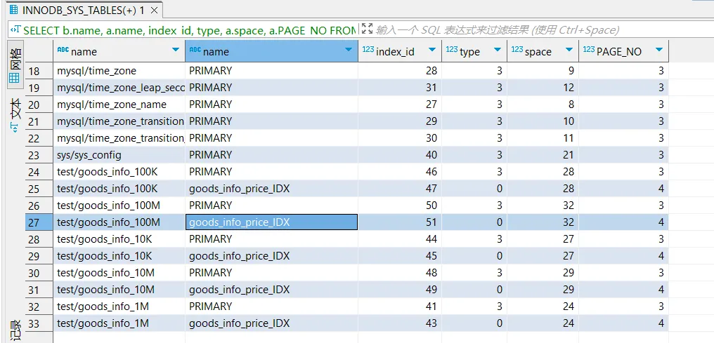
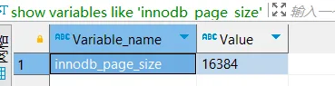
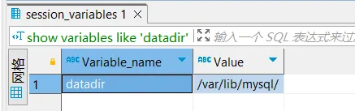
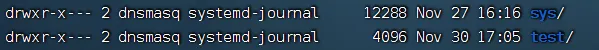
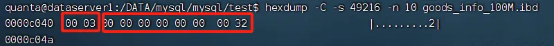
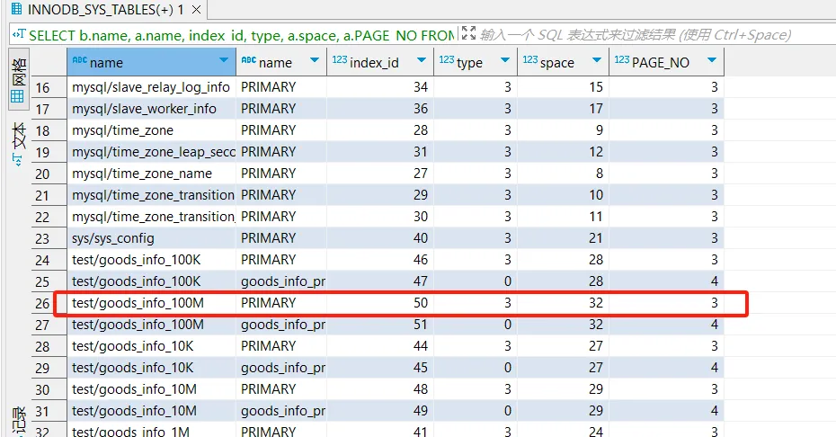

# 索引树高度计算
## 基本原理
Innodb是索引组织表，每个页都包含一个PAGE_LEVEL，表示当前页在索引上的高度

默认叶子节点高度为0，ROOT节点PAGE_LEVEL+1就是这棵索引高度

PAGE_LEVEL在每个页的64位偏移位置，占用2字节

找到ROOT页位置，知道单页大小，使用hexdump在指定表空间找到第PAGE_NO页的64位偏移量的后两个字节即可

## 找到ROOT页信息
```
SELECT b.name, a.name, index_id, type, a.space, a.PAGE_NO
FROM information_schema.INNODB_SYS_INDEXES a,
information_schema.INNODB_SYS_TABLES b
WHERE a.table_id = b.table_id AND a.space <> 0;
```
结果：

其中（space、PAGE_NO）指向ROOT页

space是表空间，可以是系统表空间（如ibdata1文件）或独立表空间（如每个InnoDB表的.ibd文件）。表空间由多个区（extent）组成，每个区包含连续的页（page）

也就是ROOT页是space的page_no页


## 查看innodb_page_size
```
show variables like 'innodb_page_size'
```
结果：


也就是Innodb默认的页大小16KB

## 找到ROOT的PAGE_LEVEL，得到索引高度
首先要找到表对应的ibd文件，也就是表空间文件

所在位置是MySQL的数据目录下的数据库名文件夹下

```
#查找MySQL数据目录
show variables like 'datadir'
```


我的MySQL是用Docker起的，docker中没有安装hexdump命令，不过这个目录被挂载出来了，考虑在宿主机上分析其中的ibd文件

但所在文件夹和文件权限限制了宿主机外用户访问文件夹和文件

修改权限需要到docker容器中修改该文件和对应文件夹权限
```
chmod 755 path
```
原本权限为750，禁止其他用户读写文件夹

修改后在宿主机进入文件夹中，找到所需文件，在文件夹执行命令
```
hexdump -C -s 49216 -n 10 goods_info_100M.ibd
```


前两个字节是PAGE_LEVEL，所以这个索引树高度为3+1 = 4

后面8个字节是index_id，32十六进制转10进制就是50，49216 = 16384*3 + 64，是ROOT页在PAGE_NO=3的索引树




## 总结
关键命令：
```
hexdump -C -s [innodb_page_size*PAGE_NO + 64] -n 10 [ibd filename]

```
