# AOP
基本概念：
- 编程时将所需逻辑写在切面中
    
这么做的好处是，让一些公共的逻辑，重复的代码，能够出现在统一的位置，即切面中，方便维护，减少重复代码的开发量。

- 思路上，是通过为某些切面，为某些方法提供行为增强。这种增强可能出现在方法执行前，方法执行后，方法返回前，方法异常时等。
- 实现方法上，出于对某个方法进行前置或后置逻辑的编写的角度，想要通过代理模式来实现功能。

Spring的切面实现，支持了两种代理模式：JDK动态代理（默认）、CGLIB动态代理

## Spring的动态代理实现
众所周知，代理模式的实现方法就是为当前类或者方法创建代理类
- 实际调用时调用代理类
- 代理类再调用原本方法逻辑，代理类本身可以在调用原本方法前后"编织"入一些定义好的代码，在调用原本方法前后执行"编织"入的方法，实现"方法增强"
- 探讨Spring如何实现动态代理，其实是探讨Spring如何动态创建代理类
    - 静态代理是直接硬编码编写代理类，并替换调用方方法调用代理类
    - 但是动态代理就需要有一套代码，能根据不同内容的原本类，动态构建一个代理类，并在调用原本方法前后调用切面类内编写的增强方法

### 静态代理示例
```
class ProxySubject implements Subject {
    private RealSubject realSubject;

    public ProxySubject(RealSubject realSubject) {
        this.realSubject = realSubject;
    }

    @Override
    public void request() {
        // 方法调用前的增强代码
        System.out.println("ProxySubject: Before calling the real subject.");

        // 调用被代理对象的方法
        realSubject.request();

        // 方法调用后的增强代码
        System.out.println("ProxySubject: After calling the real subject.");
    }
}
```
### Spring AOP 动态代理源码解析
接下来从源码层面逐一剖析Spring是如何实现AOP   
- 使用项目：[跬步后端项目仓库](https://github.com/constructor-md/kuibu-service)   
- Branch: main 
- commit: f2763b5c8308f59a399ad32ae2cdffef8aee1ee0  
  
我的项目采用 SpringBoot:2.7.6 版本，直接引入 spring-boot-starter-aop 包
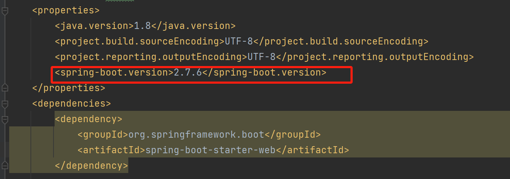
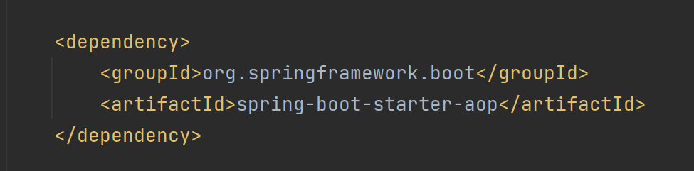

spring-boot-starter-aop 包内含 org.springframework.spring-aop 和 org.aspectj.aspectjweaver 包
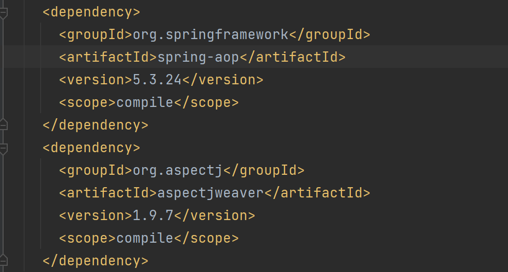

在项目启动类中，加上了 @EnableAspectJAutoProxy 注解开启 AOP 功能，从这里开始往下梳理
```
@SpringBootApplication
@EnableAspectJAutoProxy
public class Application {

    public static void main(String[] args) {
        SpringApplication.run(Application.class, args);
    }

}
```
在 @EnableAspectJAutoProxy 注解中，导入了 AspectJAutoProxyRegistrar 类
```
@Target({ElementType.TYPE})
@Retention(RetentionPolicy.RUNTIME)
@Documented
@Import({AspectJAutoProxyRegistrar.class})
public @interface EnableAspectJAutoProxy {
    boolean proxyTargetClass() default false;

    boolean exposeProxy() default false;
}
```
Spring启动过程中会对配置类进行解析和处理，其中包括对各种注解的解析  
当扫描到 @Import 注解时，会根据导入的类进行对应的处理，当前导入的 AspectJAutoProxyRegistrar 类是 ImportBeanDefinitionRegistrar 接口的实现类，对于这样的类，Spring 执行时会将它实例化，并执行其中的 registerBeanDefinitions 方法   
registerBeanDefinitions 会调用 registerAspectJAnnotationAutoProxyCreatorIfNecessary 方法
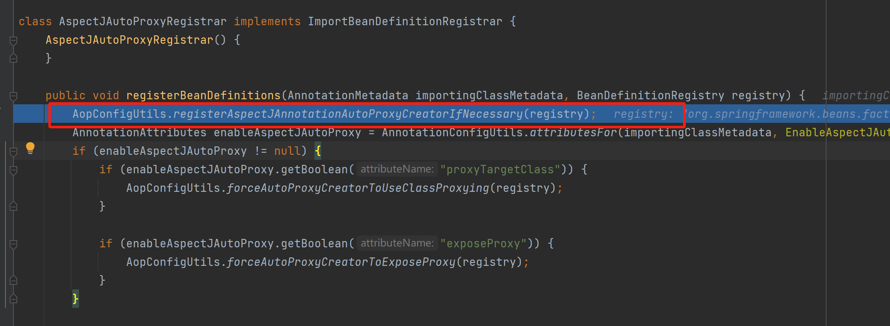
在 registerAspectJAnnotationAutoProxyCreatorIfNecessary 方法调用链上，会将 AnnotationAwareAspectJAutoProxyCreator 类定义注册到 Spring ，Spring容器启动时会根据 BeanDefinition 创建 Bean 
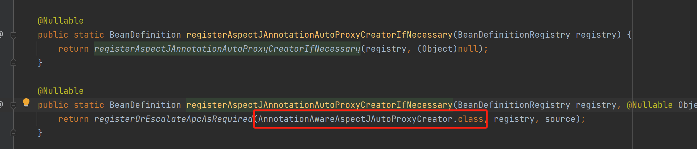
 
同时 AnnotationAwareAspectJAutoProxyCreator 的父类 AbstractAutoProxyCreator 实现了 BeanPostProcessor 接口的 postProcessAfterInitialization 方法，在容器内 Bean 初始化后，Spring 容器会遍历所有注册的 BeanPostProcessor 实现类，并依次调用它们的 postProcessAfterInitialization 方法，所以该方法会经过所有的 Bean 
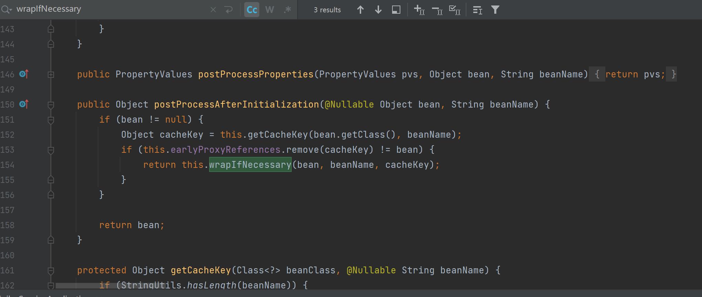
而 AbstractAutoProxyCreator 是 Spring AOP 中自动创建代理的抽象基类，其核心作用是在 Spring 容器创建 Bean 的过程中，自动为符合条件的 Bean 创建代理对象，包括各式各样需要代理类的方法，比如可能的Mapper、Service、Controller等会出现在这里  
我的项目中创建了 LoginAspect 切面
```
@Aspect
@Component
public class LoginAspect {
    @Pointcut(value = "@annotation(com.awesome.kuibuservice.annotation.Login)")
    public void pointCut() {
    }

    @Around("pointCut()")
    public Object checkToken(ProceedingJoinPoint joinPoint) throws Throwable {
        # 切面逻辑
    }
}

```
该切面以一个注解定义切点，并在 UserController 的 getUserInfo 方法加上了注解
```
@RequestMapping("/user")
@RestController
public class UserController {
    @Login
    @GetMapping("/userinfo")
    public R<UserInfoDto> getUserInfo() {
        # 接口逻辑
    }
}
```
以下显示这个 Bean 被扫描到，发现该 Bean 具有适用的**增强器** LoginAspect，需要创建代理对象
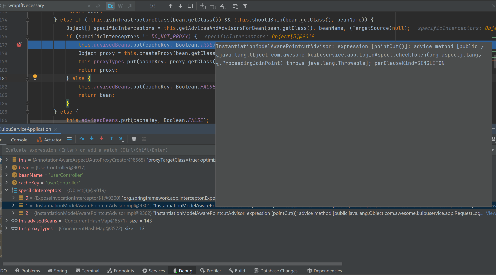  
于是调用 createProxy 为这个 Bean 创建代理对象
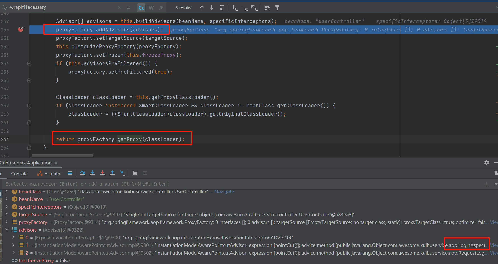  
在 createProxy 方法中，将**增强器**列表交给 ProxyFactory , 并调用 ProxyFactory.getProxy 创建代理对象  
在 getProxy 方法中，调用了 createAopProxy 方法，该方法属于 ProxyFactory 的父类 ProxyCreatorSupport ，ProxyCreatorSupport 的父类是 AdvisedSupport，之前被设置给 ProxyFactory 的**增强器**列表放在该类的 advisors 属性中  

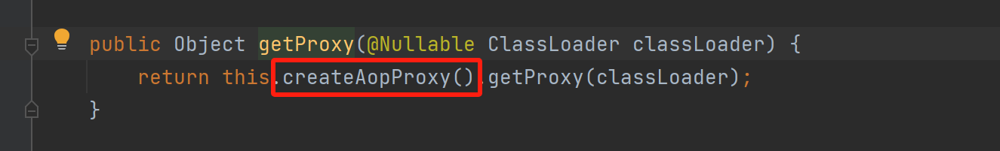  
createAopProxy 方法调用 AopProxyFactory 的 createAopProxy 方法，并将 ProxyCreatorSupport 对象本身传入，前面说过 ProxyCreatorSupport 带有**增强器**列表 advisors
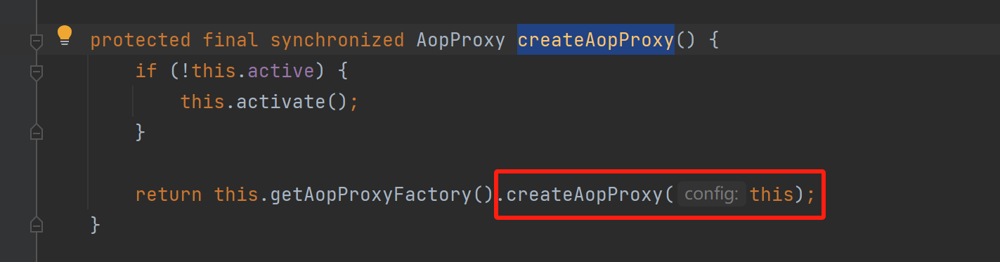  
AopProxyFactory 的 createAopProxy 方法，带有**增强器**列表，根据条件选择创建 JDK 动态代理，或 Cglib 动态代理 
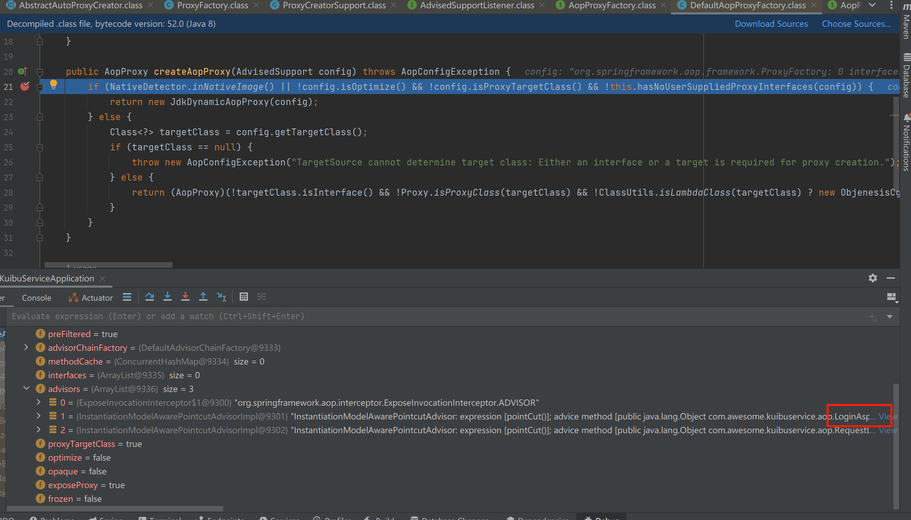  
代码解释：
```
if (NativeDetector.inNativeImage() 
    || 
    !config.isOptimize() && !config.isProxyTargetClass() && !this.hasNoUserSuppliedProxyInterfaces(config)
    ) {
            return new JdkDynamicAopProxy(config);
        }
```
- 如果处于原生镜像环境，就使用JDK动态代理
- 如果没有开启优化选项、且没有强制使用 CGLIB 代理目标类、且没有用户提供的代理接口，就使用JDK动态代理
```
 else {
            Class<?> targetClass = config.getTargetClass();
            if (targetClass == null) {
                throw new AopConfigException("TargetSource cannot determine target class: Either an interface or a target is required for proxy creation.");
            } else {
                return (AopProxy)(!targetClass.isInterface() && !Proxy.isProxyClass(targetClass) && !ClassUtils.isLambdaClass(targetClass) ? new ObjenesisCglibAopProxy(config) : new JdkDynamicAopProxy(config));
            }
        }
```
在能获取到目标类的基础上：  
如果目标类不是接口、不是 JDK 代理类且不是 Lambda 表达式类，则使用 CGLIB 代理  
接下来分别解释两种动态代理的创建


### CGLIB 动态代理
可能由于版本等原因，我的项目实现的自定义切面，就算让切点加在实现了接口的方法上，为目标类生成的代理类仍是 CGLib 代理   
可以设置强制其在切点加在实现了接口的方法上时实现JDK自动代理，以便 Debug ，但是目前注解加在没有实现接口的 controller api 方法上  
先讨论 CGLib 动态代理  
  
在这块代码中，if 中的判定结果和含义如下：
1. NativeDetector.inNativeImage() 为 false ，表示当前不是运行在原生镜像环境，而是普通Java虚拟机环境
2. !config.isOptimize() 为 false ，表示 AOP 启用了某种优化设置
3. !config.isProxyTargetClass() 为 false ，表示 AOP 配置指定使用目标类代理，即无论目标对象是否实现接口，都优先使用 CGLIB 代理来创建代理对象，而不是 JDK 动态代理
    
else 中的判定结果和含义如下：
1. !targetClass.isInterface() 为 true，表明目标类不是接口，而是具体类。JDK 动态代理只能对实现了接口的类进行代理，此时应使用 CGLIB 代理
2. !Proxy.isProxyClass(targetClass) 为 true，表明目标类不是一个 JDK 动态代理生成的类，可以考虑使用 CGLIB 对其生成代理
3. !ClassUtils.isLambdaClass(targetClass) 为 true，表明目标类不是 Lambda 表达式生成的类，可以考虑使用 CGLIB 对其生成代理  
  
于是方法最终生成执行了 new ObjenesisCglibAopProxy(config)，主要功能是利用 CGLIB 库生成目标对象的代理对象，而 config 中包含了需要织入代理对象执行前后的**增强器**列表  
所以在 ProxyFactory.getProxy 方法中，createAopProxy() 返回的是 ObjenesisCglibAopProxy 对象
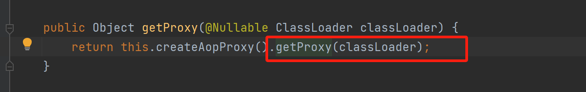  
getProxy() 方法由 CglibAopProxy 实现
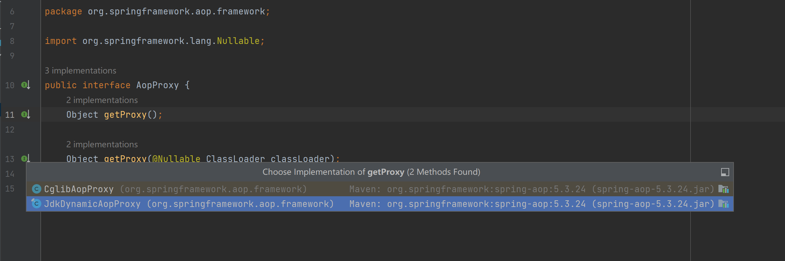  
继续 Debug 进入 CglibAopProxy 的 getProxy() 方法实现  
其中关键在于，带有**增强器**方法的 callbacks 被带入代理对象的创建和实例化方法中
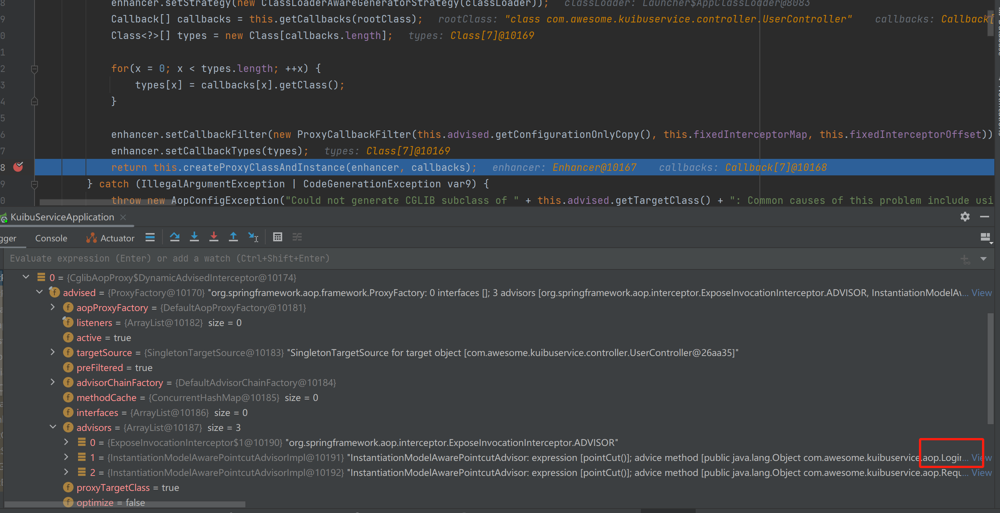 
继续 debug createProxyClassAndInstance 方法，实际执行的是 ObjenesisCglibAopProxy 的实现
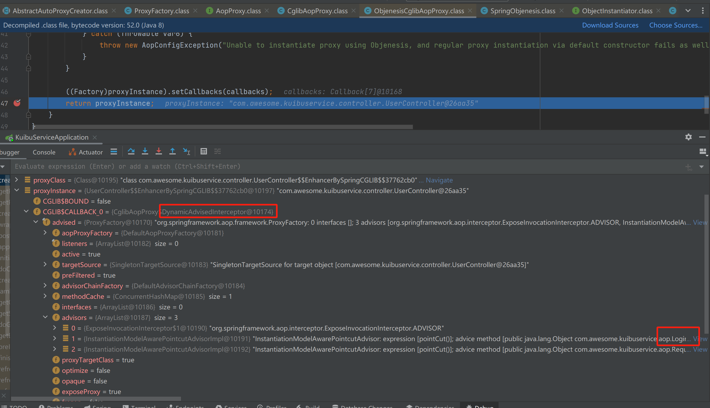 
可见该方法就是创建代理类并实例化，并将带有**增强器**列表的 **DynamicAdvisedInterceptor** 对象设置到代理对象中  
   
   
以上源码揭示的是，CGLIB 创建代理对象的过程，而这一切代理对象的创建源头是最初 AbstractAutoProxyCreator 类的 BeanPostProcessor 接口的 postProcessAfterInitialization 方法实现被 Spring 扫描执行，所以对于当前被扫描到的 Bean userController，Cglib为其创建了代理对象如下，其代理对象包含了**增强器**方法，而 **Spring 容器实际管理的 Bean 也是这个代理对象**，也就是**所谓的增强器被织入代理对象**
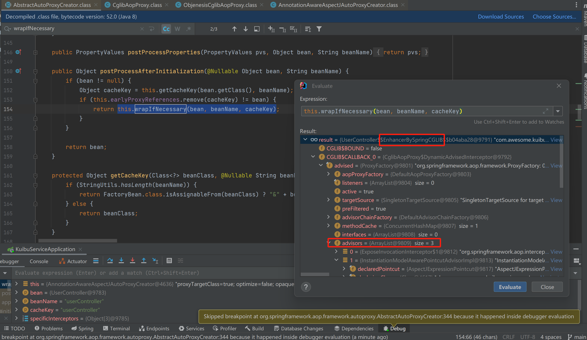 

调用 API 执行到该 userController 的方法时，Spring 实际是取得 userController 的 CGLib 代理对象，尝试调用其方法  
而在创建 CGLib 代理对象时，是使用字节码技术生成代理类并实例化，可以在 ObjenesisCglibAopProxy 的 createProxyClassAndInstance 查看 enhancer.createClass() 底层创建了类，生成的类中有诸多方法，不过无法看见其实现细节  
总之，代理类方法被调用时，会调用其回调方法，而前面提到，我们的代理对象中携带**增强器**列表的是 **DynamicAdvisedInterceptor** 对象，其带有自定义切面 LoginAspect 增强器，找到**DynamicAdvisedInterceptor** 进行 debug，它是 CglibAopProxy 的静态内部类，也是 MethodInterceptor 实现类，在 api 方法 被调用时，触发 MethodInterceptor 拦截，执行其实现的 interceptor 方法
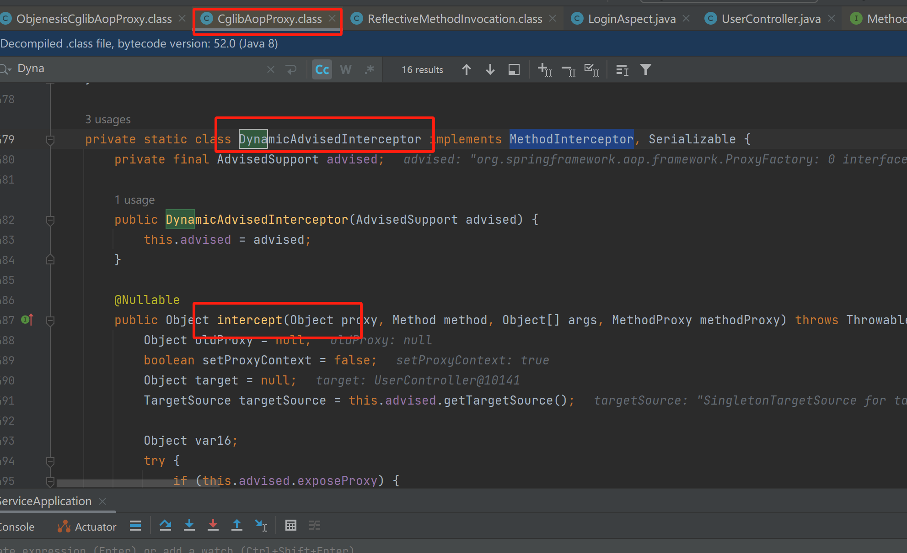 
interceptor 方法中debug，可见其构建了拦截器链，并 new CglibMethodInvocation 对象，执行了 proceed 方法
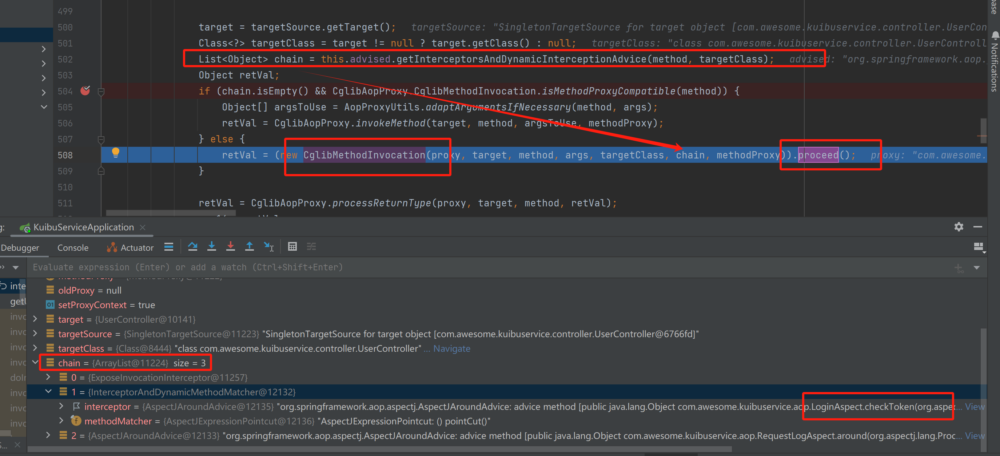 
new CglibMethodInvocation 时传入了拦截器链，设置到了父类属性 ReflectiveMethodInvocation.interceptorsAndDynamicMethodMatchers 上  
而在执行 proceed 方法时，将拦截器取出并执行，可见执行的拦截器就是我们自定义切面中的代码  
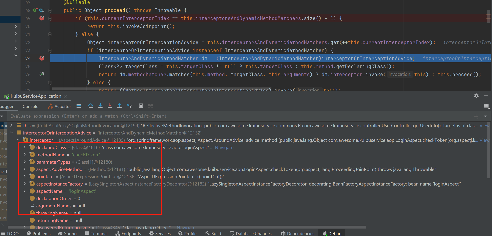 

### JDK 动态代理
通过设置配置文件 spring.aop.proxy-target-class=false 可以生成 JDK 动态代理
无非是在创建代理对象时判定了执行 new JdkDynamicAopProxy(config) 条件分支，使用 JDK 提供的字节码生成技术来生成代理对象，而后的设置增强器列表、执行时执行拦截器方法等流程都和 CGLib 基本一致
  

## 总结 
总的来说，Spring 的动态代理实现过程就是
1. 在 Bean 初始化过程中，判断如果需要生成代理对象，就根据当前配置，生成 JDK 动态代理对象或 CGLib 动态代理对象，然后将代理对象作为实际的 Bean 交给 Spring 容器管理
2. 代理对象设置了 advice 拦截器方法链 （所谓的切面方法增强 织入目标方法前后）
3. 当目标类方法被调用时，实际上是代理对象的方法被调用，而代理对象方法调用目标类方法前后，根据方法上的 advice 拦截器链执行各个切面代码，完成方法的增强功能


