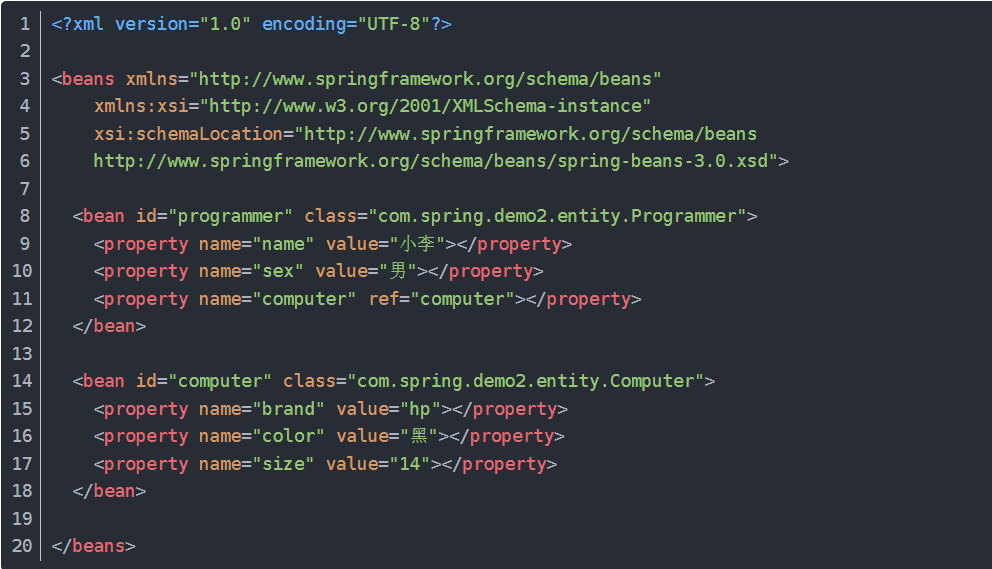
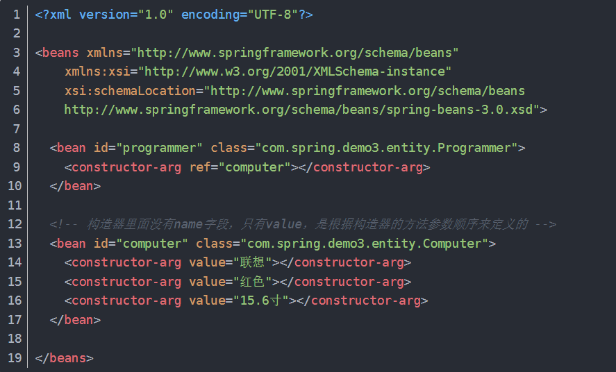

# 依赖注入|控制反转|自动装配

## 控制反转(IOC)与依赖注入(DI)
控制反转基本概念：     
    将对象的创建和管理的控制权，从某个实体类，转交给 Spring 容器  
> 在传统模式中，对象需要哪些资源就要在类代码中写明自己去 new 出来  
> 现在则统一由 Spring 提供，从主动变成了被动。称为控制反转

依赖注入基本概念：  
    对象间的依赖关系，被 Spring 容器自动注入到需要他们的对象中去
> 也就是由 Spring 容器来管理对象间的依赖关系
依赖注入是控制反转的一种实现形式  
1. 指的是组件自身提供普通的 Java 方法声明依赖关系。容器全权负责组件依赖关系的装配，将根据这些声明主动将符合依赖关系的对象设置给需要的对象，实现原理是反射
2. 为了实现控制反转的概念，Spring 实现了依赖注入的机制

依赖注入机制的使用方式：
1. 属性注入形式
    xml方式：使类有 Set 方法，并设置 bean 和 property 。Spring 读取 xml 文件时，认为需要向 bean a 注入 bean b。这实质上是通过，使类有 set 方法，从而可实现用xml文件声明属性依赖关系，从而声明依赖关系，寻求注入的方式。

2. 构造器注入形式
    xml方式：使类具备有参构造函数，并设置 bean 和 property。实质上与上述是相似的，只是多支持了一种声明的方式。

3. Java显式配置
- 通过注解，描述某个类应该作为 Bean 被容器管理，且内部包含一些如何在上下文中创建 Bean 的细节。如 @Configuration。
- 通过注解，描述某个方法的返回结果应该作为 Bean 被容器管理，如 @Bean。
    
## 自动装配
上述的依赖注入的使用方式，实际上都是在告诉 Spring 容器如何装配对象间的依赖关系
Spring 对于描述 Bean 如何进行装配时，提供了三种主要的装配机制：
1. XML中显式配置描述
2. Java中显式配置描述（就是通过 @Configuration + @Bean 描述 Bean 的创建）
3. 隐式的 Bean 发现机制和自动装配（就是通过 @Component + @Autowired 等描述自动扫描和注入）

自动装配的 Spring 实现：
1. 组件扫描：通过注解配置，Spring 会自动发现应用上下文中创建的Bean
    1. 通过 @ComponentScan 配置组件扫描的包
    2. 通过 @Component 声明一个类为组件
    3. Spring 将扫描包并找到组件，为这些组件创建 Bean 并放入容器中
    
2. 自动装配：Spring自 动满足 Bean 之间的依赖关系
    1. 在构造器上加上 @Autowired，则 Spring 构造对象时，将传入对应的 Bean。（注解式的构造器注入）
    2. 在Setter或其他方法上加上 @Autowired ，则 Spring 初始化 Bean后，会尽量满足 Bean 的依赖，就会注入指定的 Bean。（注解式的属性注入）
    3. 将 @Autowired 直接加在属性上
    

## 理解
控制反转的优点：   
（理解中，依赖注入和自动装配机制，都是为了让控制反转模式能够合理运行的实现）   
如A需要B实现功能  
- 按传统模式，则需要在 A 中 new B()，这时当 B 需要改动时，则 A 与 B 有关的功能代码可能都需要改动
- 有了控制反转，将依赖关系交给容器装配，则我们只需改动 B，就可以让容器初始化一个不同的 B 注入到 A 中，尽量少地避免了上层的改动
> - 这其实是依赖倒置原则的实现   
> - 实现依赖倒置原则，使得高层建筑可以不关心底层建筑的实现，避免牵一发动全身  
> - 为了实现依赖倒置原则，思路是做控制反转，方法是实现依赖注入，为了实现依赖注入，做了个IOC容器去管理Bean的生成和装配等  
> - 降低了组件间的耦合度  

在Spring项目中的影响逻辑：   
- 由于依赖倒置原则具有修改底层建筑，尽量少地影响上层建筑地好处
- Spring为了实现依赖倒置原则，构想了控制反转的模式。即将对象的创建、装配、生命周期管理等，交给 IOC 容器来进行，相比让对象自己去 new，使得组件间耦合度降低
- IOC 容器管理 Bean，首先是在启动时，通过读取 XML/ Java 注解等方式，理解声明的 Bean 和装配方式，生成 Bean 并注册到容器中，进行后续管理。
- 组件的耦合度降低页实现了 Controller、Service、Dao 软件各层之间的解耦
- IOC 容器创建 Bean 提供了单例模式的支持，使得开发人员不需要自己实现
- 组件间的解耦使得 Spring 使用第三方组件时可以实现无痛的切换底层实现，优势仅需修改一些配置，即可使得实例化地 Bean 是另一套实现，则被注入地是另一套实现，只需做好底层接口即可。
