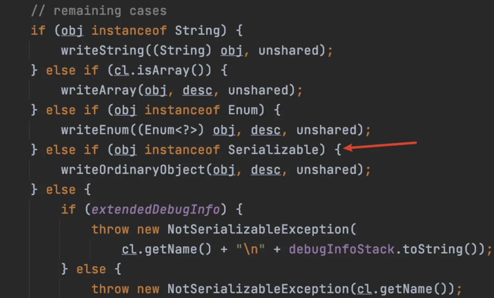
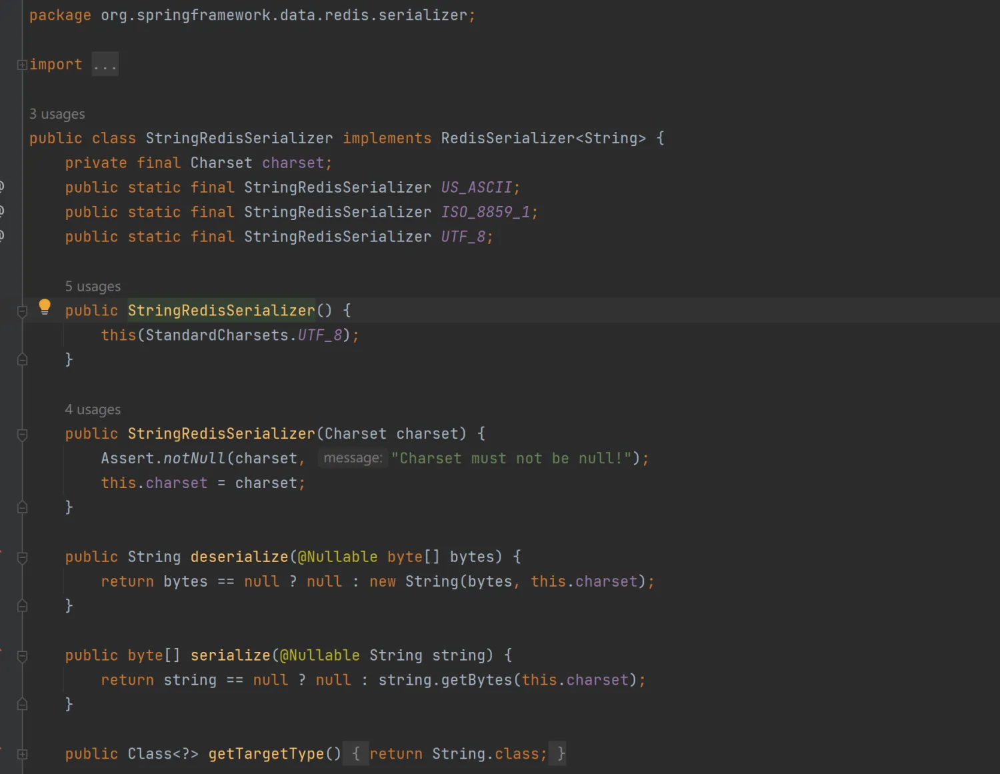
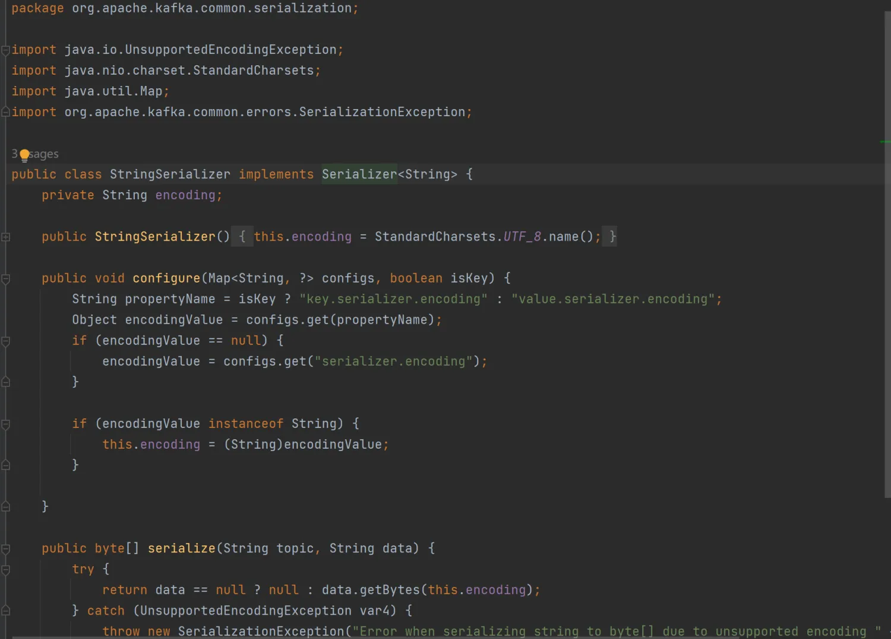

# 序列化和反序列化
## 基本介绍
● 序列化
对象转换为字节流的过程  
转换为字节流后可以进行网络传输、持久化存储或者缓存   
Java提供java.io.Serailizable 接口支持序列化，只要实现这个接口，就可以将该类的对象进行序列化。  

● 反序列化
将字节流重新转换为对象的过程

● 关键类和接口
ObjectOutputStream 用于序列化  
ObjectInputStream 用于反序列化  
类必须实现 Serializable 接口才能被序列化  

● transient 关键字
使用 transient 关键字可以指定让某些字段不被序列化  

● serialVersionUID
每个类都应该定义一个 serialVersionUID，用于反序列化时验证版本一致性  
如果不指定，Java会根据类定义自动生成UID，版本不匹配可能导致反序列化失败  
类似指纹  

● 性能
Java 默认的序列化机制可能比较慢，尤其对于大规模分布式系统，可能选择更高效的序列化框架，如 protobuf、kryo

● 安全性
反序列化可能导致潜在安全风险，因为通过恶意构造的字节流可能导致加载不安全类或者执行不期望的代码。所以要警惕字节流来源，对不确定的字节流反序列化时进行输入验证，避免漏洞

## 必须要实现 Serializable 吗
此前所述：类必须实现 Serializable 接口才能被序列化  
主要是指序列化使用Java原生序列化器（ObjectOutputStream， ObjectInputStream），其中存在是否实现该接口的判断  

 

这里使得String、数组、枚举之外的类必须实现 Serializable，否则抛出异常  
但许多Spring实现的第三方带有数据存储和传输能力的组件接入类，一般自定义实现序列化和反序列化器，而且不继承 Java 原生序列化和反序列化器  
如 spring-data-redis：  
 

apache kafka：
 

所以许多情况下，可以看见一些类不需要实现 Serializable 接口一般也能正常使用功能。  
许多类或者规范，需要实现 Serializable 接口的主要原因是，防止系统中存在混杂使用 Java原生序列化器的情况  
